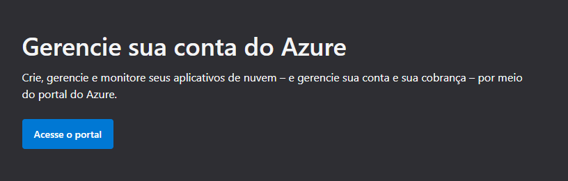

[Menu](../README.md)

# Instalação

Para baixar a versão de estudante do [MSProject](https://www.microsoft.com/pt-br/microsoft-365/project/project-management-software), caso seja estudante na faculdade Senac RS, siga os seguintes passos:

## Login

Acesse o site: [Azure](https://azure.microsoft.com/)

Clique em entrar no canto superior direito:

Seu login será:

- **Usuário:** CPF@senacrs.edu.br
- **Senha:** Senha do portal do aluno

> **Usuário:** o CPF é **sem pontos, hífen e espaços** entre os números
>
> **Senha:** O portal do aluno está localizado [neste link](https://apsweb.senacrs.com.br/modulos/aluno/login.php5?).

Agora clique em **minha conta**:

Clique em **acesse o portal**:

## Baixando o MS Project

Abrira uma tela, como a abaixo:

Clique em **educação**:

> Caso não encontre use a barra de pesquisas para encontrar, digitando **educação**.

***

# Criador

Olá me chamo Gustavo, e criei este material, para mais informações, clique nos links abaixo:

* [LinkTree](https://www.linktree.com.br/gusleaooliveira)

* Disponível em : [Repositório de exercícios](