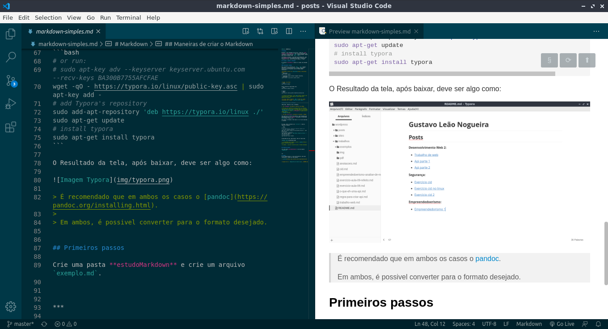
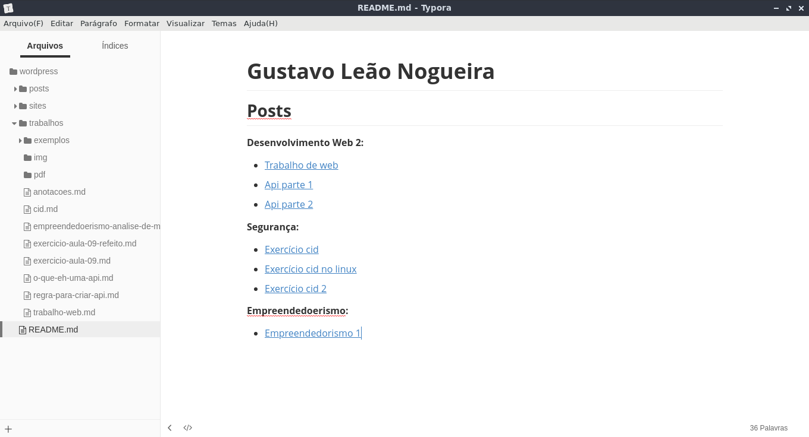

[Menu](../README.md)

# Markdown

Markdown é uma linguagem de marcação, criada por **John Gruber** e **Aaron Swartz**, com o foco de facilmente ser entendida e convertida pra `.html` (posteriormente, também para outros formatos como `.odt`, `.pdf`).

Atualmente o markdown é utilizado em documentações, como os **"README.md"** utilizados no github, e também para trabalhos e criar sites de maneira simples e rápida.

## Criando e rodando o Markdown

Os arquivos **"markdown"** devem ser criados com extensão `.md`.

### Instalando o pandoc

Para converter os arquivos em `.html`, `.pdf` e demais extenções, é necessário baixar os pandoc (mesmo que utilize outras ferramentas, pois as mesmas podem necessitar).

* No Windos, através do [Chocolatey](https://chocolatey.org/):
```powershell
choco install pandoc
```
É recomendado também instalar algumas extenções:
```powershell
choco install rsvg-convert python miktex
```

* No Mac, via briew:
```bash
brew install pandoc
```

Outras extenções requisitadas são:
```bash
brew install pandoc-citeproc
```

E também:
```bash
brew install librsvg python homebrew/cask/basictex
```

> A página de downloads é esta [aqui](https://pandoc.org/installing.html), ondem podem ser encontradas mais maneiras de instalar.

* No linux, baixe o arquivo `.deb` e rode com o gdebi (instalado com o comando `sudo apt install gdebi`).

Com extra instale:
```bash
sudo apt-get install texlive-latex-base
sudo apt-get install texlive-fonts-recommended
sudo apt-get install texlive-fonts-extra
```


## Maneiras de criar o Markdown

Temos duas  maneiras criar o markdown:

1. Via **código**, de maneira a mostrar seu código.

> Para que seja exibida em um modo preview, os editores tem extenções, como no caso do VSCode, que tem a extensão `Markdown Preview Enhanced`, que instalando e pressionando `ctrl+shift+v` vai abrir o **"Preview"**, ficando como na imagem abaixo:
> 

2. Via modo **gráfico**, de maneira a esconder o código.

Para quem quer escolher esta maneira, uma ferramenta que possibilita isso é o **Typora**, que pode ser encontrado [aqui](https://typora.io/).

Para baixar no Windows e Mac basta ir na área de download, e instalar.


No linux, abra o terminal com `ctrl+alt+t` e rode os seguintes comandos:

```bash
# or run:
# sudo apt-key adv --keyserver keyserver.ubuntu.com --recv-keys BA300B7755AFCFAE
wget -qO - https://typora.io/linux/public-key.asc | sudo apt-key add -
# add Typora's repository
sudo add-apt-repository 'deb https://typora.io/linux ./'
sudo apt-get update
# install typora
sudo apt-get install typora
```

O Resultado da tela, após baixar, deve ser algo como:



> É recomendado que em ambos os casos o [pandoc](https://pandoc.org/installing.html).
>
> Em ambos, é possivel converter para o formato desejado.


## Primeiros passos

Crie uma pasta **estudoMarkdown** e crie um arquivo `exemplo.md`.

Abra a pasta e o arquivo (utilizarei o vscode, mas pode ser feito no typora que tem comandos e será tudo gráfico).

### Comandos
#### Parágrafos

Para novos Parágrafos devemos digitar `enter`, para criar uma nova linha, sendo que entre cada parágrafo **devem** existir novas linhas entre cada parágrafo, ficando:

```markdown
Novo parágrafo, pode ser extremamente curto. Abaixo segue um lorem ipsum:

Lorem ipsum dolor sit amet, consectetur adipisicing elit, sed do eiusmod tempor incididunt ut labore et dolore magna aliqua. Ut enim ad minim veniam, quis nostrud exercitation ullamco laboris nisi ut aliquip ex ea commodo consequat. Duis aute irure dolor in reprehenderit in voluptate velit esse cillum dolore eu fugiat nulla pariatur. Excepteur sint occaecat cupidatat non proident, sunt in culpa qui officia deserunt mollit anim id est laborum.
```

Ficando:

Novo parágrafo, pode ser extremamente curto. Abaixo segue um lorem ipsum:

Lorem ipsum dolor sit amet, consectetur adipisicing elit, sed do eiusmod tempor incididunt ut labore et dolore magna aliqua. Ut enim ad minim veniam, quis nostrud exercitation ullamco laboris nisi ut aliquip ex ea commodo consequat. Duis aute irure dolor in reprehenderit in voluptate velit esse cillum dolore eu fugiat nulla pariatur. Excepteur sint occaecat cupidatat non proident, sunt in culpa qui officia deserunt mollit anim id est laborum.


#### Títulos

Os Títulos, que vão de 1 até 6, são jogos da velha, como é mostrado abaixo:

```markdown
# Título 1
## Título 2
### Título 3
#### Título 4
##### Título 5
##### Título 6   
```
Com o resultado ficaria:

# Título 1
## Título 2
### Título 3
#### Título 4
##### Título 5
##### Título 6   

Os títulos vão do mais importante (principal), que é o `#` único, e vai até o de menor valor `######`. **Todos** devem ser separados por um espaço do texto.

#### Enfatizar
Para deixar um texto em negrito (`**` ou `__` antes e depois do texto), itálico (`*` ou `_` antes e depois do texto) ou riscado (`~~` antes e depois do texto) basta:
```markdown
Meu texto de exemplo, __parte__ está em **negrito**.

Parte do *meu* texto está em _itálico_

Texto ~~riscado~~.
```  

Com o resultado ficando:

Meu texto de exemplo, __parte__ está em **negrito**.

Parte do *meu* texto está em _itálico_

Texto ~~riscado~~.

#### Linhas

Linhas podem ser feitas com `***`, ou `---` ou `___`, separando antes, e depois com novas linhas ficando:

```markdown
Exemplificando

***

Temos uma linha com asteriscos

---

Com hifens

___

Com underline
```


Temos uma linha com asteriscos

---

Com hifens

___

Com underline

#### Listas Desordenadas

Listas desordenadas, podem ser feitas com um `*` ou `+` ou `-`, separando por espaço do texto.

```markdown
Lista:
* Item
* Item
* Item

Lista:
+ Item
+ Item
+ Item

Lista:
- Item
- Item
- Item
```

Demonstrando fica:

Lista:
* Item
* Item
* Item

Lista:
+ Item
+ Item
+ Item

Lista:
- Item
- Item
- Item

#### Listas Ordenadas

Listas desordenadas, podem ser feitas com um `1.` e suas sequências, ou apenas digitando `1.`, separando por espaço do texto.

```markdown
Lista com Números:
1. item 1
2. item 3
3. item 4
4. item 5

Lista repitindo o número 1., ficando:
1. algum item
1. algum item
1. algum item
1. algum item
```

Demonstrando:

Lista com Números:
1. item 1
2. item 3
3. item 4
4. item 5

Lista repitindo o número 1., ficando:
1. algum item
1. algum item
1. algum item
1. algum item

> Para ambos os tipos de lista é possível criar sublistas, que devem ser colocadas em uma nova linha com uma tabulação(`tab`).

#### Links

Temos links simples, com redirecionamento relativo e com título:
```markdown
Simples:
[link simples](https://www.linktree.com.br/gusleaooliveira)

Relativo:
[link simples](../README.md)

Com título:
[link com título](https://www.linktree.com.br/gusleaooliveira "Título")
```
Ficando:

Simples:
[link simples](https://www.linktree.com.br/gusleaooliveira)

Relativo:
[link simples](../README.md)

Com título:
[link com título](https://www.linktree.com.br/gusleaooliveira "Título")


#### Imagens

Para adicionar imagens e gifs, basta colocar:

```markdown


```

Ficou:


#### Código

Códigos podem ser em linha e devem estar contidos em ` `` `, também separando por um espaço do texto:

```markdown
Este é um código de exemplo, digite: `print("Hello, Cruel World!")`
```
Demonstrando fica:

Este é um código de exemplo, digite: `print("Hello, Cruel World!")`

Também são permitidos códigos em blocos, identados, que podem ter destaque de sintaxe, como:

```markdown

Javascript:
    ```javascript
      console.log('Hello, Cruel World!');
    ```
Python:
    ```python
      print("Hello, Cruel World!")
    ```
Java:
    ```java
      System.out.println("Hello, Cruel World!")
    ```

```

Resultando em:

Javascript:
```javascript
  console.log('Hello, Cruel World!');
```

Python:
```python
  print("Hello, Cruel World!")
```

Java:
```java
  System.out.println("Hello, Cruel World!")
```

> Repare que coloquei varias linguagens, podem ser colocadas outras demais, basta colocar ao lado dos  ` ``` `.

#### Observações

Observações podem ser feitas com o `>`, dando um espaço entre o mesmo e o texto:

```markdown
> observação de exemplo
```

> observação de exemplo


#### Tabelas

Tabelas são criadas com o uso do `|` e do `-` no seguinte formato:

```markdown
| Nome | O que é | Idade |
|----|----|----|
| Gustavo | Filho | 23 |
| Sônia | Mãe | 51 |
| Bárbara | Amiga | - |
```

Que ficou assim:

| Nome | O que é | Idade |
|----|----|----|
| Gustavo | Filho | 23 |
| Sônia | Mãe | 51 |
| Bárbara | Amiga | - |


#### Código html

Código pode ser adicionado com:

```markdown
<dl>
  <dt>Definition list</dt>
  <dd>Is something people use sometimes.</dd>

  <dt>Markdown in HTML</dt>
  <dd>Does *not* work **very** well. Use HTML <em>tags</em>.</dd>
</dl>
```

Executando ficaria:

<dl>
  <dt>Definition list</dt>
  <dd>Is something people use sometimes.</dd>

  <dt>Markdown in HTML</dt>
  <dd>Does *not* work **very** well. Use HTML <em>tags</em>.</dd>
</dl>

#### Emojis

Emojis podem ser incorporados quando colocados entre `:` e com espaços antes e depois dos  `:`, como abaixo:

```markdown
Olá, :earth_americas:. Este é um exemplo de emoji :blush:.
```

Olá, :earth_americas:. Este é um exemplo de emoji :blush:.

> A lista com todos os esmojis é esta [aqui](https://gist.github.com/rxaviers/7360908).


### Convertendo  com o pandoc

Primeiramente coloque os comandos que deseja dentro do arquivo, que em meu caso será:

```markdown
# Hello, Cruel World!

Este é um exemplo!!!!

***

# Criador
Olá me chamo Gustavo, e criei este material, para mais informações, clique nos links abaixo:

* [LinkTree](https://www.linktree.com.br/gusleaooliveira)


* Disponível em : [Repositório de exercícios](../README.md)

```

#### Para html

Para converter para html, executamos dentro da pasta (`estudoMarkdown`):


```bash
pandoc -s -o exemplo.html exemplo.md
```

### Para pdf

Para converter para html, executamos dentro da pasta (`estudoMarkdown`):


> O exempĺo no formato `.md` pode ser encontrado [aqui](estudoMarkdown/exemplo.md).
> O exempĺo no formato `.html` pode ser encontrado [aqui](estudoMarkdown/exemplo.html).
> O exempĺo no formato `.pdf` pode ser encontrado [aqui](estudoMarkdown/exemplo.pdf).

```bash
pandoc -s -o exemplo.pdf exemplo.md
```

***

# Criador
Olá me chamo Gustavo, e criei este material, para mais informações, clique nos links abaixo:

* [LinkTree](https://www.linktree.com.br/gusleaooliveira)


* Disponível em : [Repositório de exercícios](../README.md)
