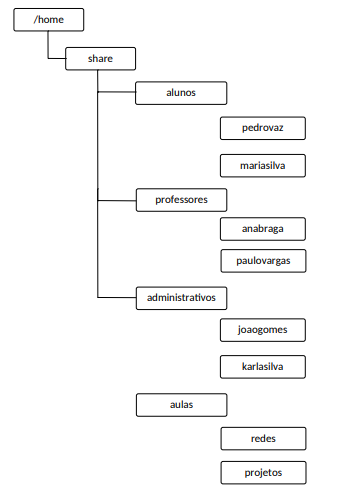

[Menu](../README.md)


**Superior em Tecnologia de Redes de Computadores**

**Disciplina:** Adm. de Sist. Op. Não-Proprietários

**Professor:** Ademir Dorneles


# Avaliação Prática II
## Tarefa 01
### Criação de usuários e grupos

1. Crie os grupos:
  * alunos
  * professores
  * administrativos

```bash
groupadd alunos
groupadd professores
groupadd administrativos
```

2. Crie os seguintes usuários, inserindo-os em seus respectivos grupos:

| **Grupo primário**  | **Usuários**    |
|---------------------|-----------------|
| alunos              |     pedrovaz    |
||     mariasilva  |
| professores         |     anabraga    |
||     paulovargas |
| administrativos     |     joaogomes   |
||     karlasilva  |

> O diretório home dos usuários deverá ser: /home/share/grupo/nome_usuario onde <grupo> deve ser o grupo que o usuário pertence, para isso utilize a opção -d, não utilize a opção -m, pois os diretórios serão criados posteriormente

```bash
useradd pedrovaz -g alunos -d /home/share/alunos/pedrovaz
useradd mariasilva -g alunos -d /home/share/alunos/mariasilva

useradd anabraga -g professores -d /home/share/professores/anabraga
useradd paulovargas -g professores -d /home/share/professores/paulovargas

useradd joaogomes -g professores -d /home/share/administrativos/joaogomes
useradd karlasilva -g professores -d /home/share/administrativos/karlasilva
```

2. Defina a senha de acesso para os usuários criados:.

```bash
passwd pedrovaz
passwd mariasilva
passwd anabraga
passwd paulovargas
passwd joaogomes
passwd karlasilva
```

Em um shell script uma maneira para colocar seria:

```bash
senha="ola123"
echo "pedrovaz:$senha" | chpasswd
echo "mariasilva:$senha" | chpasswd
echo "anabraga:$senha" | chpasswd
echo "paulovargas:$senha" | chpasswd
echo "joaogomes:$senha" | chpasswd
echo "karlasilva:$senha" | chpasswd
```

> A senha utilizada foi: `ola123`


3. Defina para todos os usuários dos grupos **professores** e **administrativos** o Shell **"BASH"** como padrão.

```bash
usermod pedrovaz -s $SHELL
usermod mariasilva -s $SHELL
usermod anabraga -s $SHELL
usermod paulovargas -s $SHELL
usermod joaogomes -s $SHELL
usermod karlasilva -s $SHELL
```

> A variável de ambiente `$SHELL` contém o caminho `/bin/bash` portanto foi utilizada no local de escrever manualmente.

4. Remova a possibilidade de execução de um SHELL para os usuários do grupo **alunos**.

```bash
usermod pedrovaz -s /bin/false
usermod mariasilva -s /bin/false
```

5. Defina, para os usuários do grupo aluno, a data de 31/12/2020 para Data de expiração da conta:   

```bash
chage pedrovaz -E 20201231
chage mariasilva -E 20201231
```


6. Defina para os usuários **anabraga** e **paulovargas** o grupo alunos como secundário:

```bash
usermod anabraga -G alunos
usermod paulovargas -G alunos
```

7. Com o comando cut, crie no diretório **/root** uma lista contendo somente os nomes dos usuários criados (em ordem alfabética). Defina como **usuarios.lst** o nome do arquivo:

```bash
tail -n 6 /etc/passwd | cut -d ":" -f 1 | sort -d > /root/usuarios.lst
```

8. Com o comando cut, crie no diretório **/root**  uma lista contendo somente os nomes dos  grupos do sistema (em ordem alfabética) com o nome de **grupos.lst**:

```bash
tail -n 3 /etc/group | cut -d ":" -f 1 | sort -d > grupos.lst
```

## Tarefa 02
### Criação dos compartilhamentos
1. Crie a seguinte estrutura de diretórios:



```bash
mkdir -p /home/share/{alunos,professores,administrativos,aulas}
mkdir -p /home/share/alunos/{pedrovaz,mariasilva}
mkdir -p /home/share/professores/{anabraga,paulovargas}
mkdir -p /home/share/administrativos/{joaogomes,karlasilva}
mkdir -p /home/share/aulas/{redes,projetos}
```
## Tarefa03
### Permissões de acesso a arquivos e diretórios

a) Defina os usuários como proprietários dos seus respectivos diretórios:

```bash
chown pedrovaz /home/share/alunos/pedrovaz
chown mariasilva /home/share/alunos/mariasilva
chown anabraga /home/share/professores/anabraga
chown paulovargas /home/share/professores/paulovargas
chown joaogomes /home/share/administrativos/joaogomes
chown karlasilva /home/share/administrativos/karlasilva
```

b) Defina o grupo proprietário dos diretórios como segue:
* Diretório alunos
  - Grupo alunos
* Diretório professores
  - Grupo professores
* Diretório administrativos
  - Grupo administrativos
* Diretório aulas
  - Grupo professores

```bash
chgrp -R  alunos /home/share/alunos
chgrp -R  professores /home/share/professores
chgrp -R  administrativos /home/share/administrativos
chgrp -R  professores /home/share/aulas
```


c) Defina as diretivas de acesso aos diretórios conforme tabela a seguir:

||| **Diretivas de acesso** ||
|-------------------||-------------------------||
| **Diretório**     | **Usuário**  | **Grupo**           | **Outros**         |
| Share             | Acesso total | Leitura e Execução  | Leitura e Execução |
| Alunos            | Acesso total | Leitura e Execução  | Sem acesso         |
|  usuarios (todos) | Acesso total | Sem acesso          | Sem acesso         |
| professores       | Acesso total | Leitura e Execução  | Sem acesso         |
|  usuarios (todos) | Acesso total | Sem acesso          | Sem acesso         |
| administrativos   | Acesso total | Leitura e Execução  | Sem acesso         |
|  usuarios (todos) | Acesso total | Sem acesso          | Sem acesso         |
| Aulas             | Acesso total | Acesso total        | Leitura e Execução |
| Redes             | Acesso total | Acesso total        | Leitura e Execução |
| projetos          | Acesso total | Acesso total        | Leitura e Execução |


```bash
chmod u=rwx,g=rx,o=rx,a=rwx /home/share/
chmod u=rwx,g=rx,o=---,a=rwx /home/share/alunos/
chmod u=rwx,g=rx,o=---,a=rwx /home/share/professores/
chmod u=rwx,g=---,o=---,a=rwx /home/share/administrativos/
chmod -R u=rwx,g=rwx,o=rx,a=rwx /home/share/aulas/
```

## Tarefa 04
### Comandos diversos
1. Crie no diretório root um diretório denominado tarefa04:

```bash
mkdir /root/tarefa04
```

2. Crie no diretório tarefa04 um arquivo denominado senhas.txt contendo as últimas 06 linhas do arquivo shadow:

```bash
tail -n 6 /etc/shadow > /root/tarefa04/senhas.txt
```

3. Desabilite a conta dos usuários **pedrovaz** e karlasilva:

```bash
usermod -L pedrovaz
usermod -L karlasilva
```

4. Crie no diretório tarefa04 um arquivo denominado shell.txt contendo as últimas 10 linhas do arquivo passwd.

```bash
tail -n 10 /etc/passwd > /root/tarefa04/shell.txt
```


5. Defina para o usuário joaogomes o grupo professores como grupo secundário:

```bash
 usermod  joaogomes -G professores
```

6. Defina o grupo administrativos como novo grupo primário do usuário paulovargas:

```bash
usermod  paulovargas -g administrativos
```

7. Expire a senha dos usuários anabraga e pedrovaz:

```bash
passwd -e anabraga
passwd -e pedrovaz
```

8. Crie um grupo chamado formandos:

```bash
groupadd formandos
```

9. Defina o grupo formandos como grupo primário dos usuários pedrovaz e mariasilva:


```bash
usermod -g formandos pedrovaz
usermod -g formandos mariasilva
```

10. Exclua o usuário anabraga, incluindo seu diretório home:

```bash
userdel -r anabraga
```

11. Altere a máscara do modo de acesso padrão para 0027:


```bash
umask 0027
```

12. Retorne a máscara padrão do sistema para 0022.

```bash
umask 0022
```

13. Faça uma cópia completa dos seguintes arquivos dentro do diretório /root/tarefa04, com os seguintes nomes:
  - **passwd:** users.txt
  - **group:** groups.txt
  - **shadow:** 1senhas.txt

```bash
cat /etc/passwd > tarefa04/users.txt
cat /etc/group > tarefa04/groups.txt
cat /etc/group > tarefa04/s.txt
```

Tarefa 05: Configuração básica de rede

14. Desligue a máquina virtual:
- [x] Feito

b) Adicione duas novas interfaces de rede em modo rede interna.
As configurações das interfaces de rede devem ficar como segue:
	* **Interface 1** = Modo Bridge
	* **Interface 2** = Rede Interna
	* **Interface 3** = Rede Interna

```bash

```

c) Inicialize o sistema;
- [x] Feito

d) Configure o arquivo interfaces como segue:

  - Interface eth0: Obter IP automaticamente
  - Interface eth1: IP estático: 172.16.1.1/26
  - Interface eth2: IP estático 2001:db8:dad0:cafe::aaaa/64

```bash

```

***

# Criador
Olá me chamo Gustavo, e criei este material, para mais informações, clique nos links abaixo:

* [LinkTree](https://www.linktree.com.br/gusleaooliveira)


* Disponível em : [Repositório de exercícios](https://gusleaooliveira.github.io/posts/)
