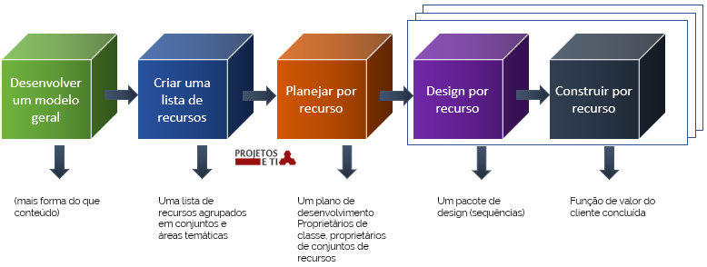

# Feature Driven Development

**Nomes:** Gustavo Leão Nogueira  de Oliveira e Caroline Ramos Roque

**Disciplina:** Engenharia de software 3

## Sumário

[TOC]


## História

Este modelo surgiu pela primeira vez no livro [Java Modeling In Color Whit UML](https://www.amazon.com/exec/obidos/ASIN/013011510X/ambysoftinc/), de 1999, mais especificamente no capítulo 6, e foi criado por Jeff de Luca e Peteter Coad.

A versão atualizada e completa está contida no livro [A Pratical Guide to Feature Driven Development](https://www.amazon.com.br/Practical-Guide-Feature-Driven-Development/dp/0130676152), de 2002.

Jeff na época trabalhava em um projeto em um banco, o [Unitad Overseas Bank](https://www.uobgroup.com/uobgroup/default.page) em Cingapura. Era necessário trabalhar na plataforma de empréstimos para corporações, comércio e consumidores abrangendo os mais variados instrumentos.

Para auxiliar a resolver os complexos problemas, que surgiam a toda hora, e pelo fato deste projeto ter um grande porte e ser crítico,  Jeff contratou Coad, trabalhando de 1997 a 1999 e desenvolveram em  conjunto o **FDD**.

## Características

O lema do **FDD** é: *"Resultados frequentes, tangentes e funcionais"*.

Feature Driven Development, ou Desenvolvimento Dirigido por Recursos tem esse nome por justamente por se concentrar em recursos.

As principais características desta metodologia:

* A cada duas semanas, ou menos, resultados uteis são apresentados
* As features, que são blocos bem pequenos de funcionalidade, são muito valorizadas pelos clientes
* Independente do tamanho da equipe funcionará com essa metodologia
* Mesmo com complexidade do sistema a ser desenvolvido, também funcionará com esse método
* Planejamento detalhado
* Guia para medição
* Rastreabilidade e relatórios com precisão
* Monitoramento detalhado dentro do projeto, com resumos de alto nível para clientes e gerentes, tudo em termos de negócio
* Fornece uma forma de saber, dentro dos primeiros 10% de um projeto, se o plano e a estimativas são sólidos

## Processos

Os processos de desenvolvimento orientado a recursos consistem em:

- *Em primeiro lugar, criando um modelo de objeto de domínio usando modelagem de objeto com seus especialistas de domínio.*
- *Em segundo lugar, os desenvolvedores usam as informações da modelagem de objeto e outras atividades e criam uma lista de recursos.*
- *Em terceiro lugar, um plano preliminar é preparado com base nos recursos e funções, e as responsabilidades são atribuídas.*
- *Além do acima, pequenos recursos ou recursos de recurso, o que leva menos de duas semanas, são utilizados.*
- *Por fim, o projeto e a codificação de cada recurso acontecem. É a fase de construção desse recurso.*

Existem cinco processos documentados no FDD, conforme mostrado na figura abaixo –



Cada um desses processos possui três critérios essenciais e possui um template representado como ETVX, que significa:

- ***E\****NTRADA Critérios: Primeiro é Critérios de Entrada que significa selecionar que tudo estará trabalhando nele.*
- ***Tarefas\****: o segundo é Tarefas, que significa quais atividades serão realizadas nesse processo*
  - *Nome*
  - *Equipes Envolvidas*
  - *Obrigatório / Opcional*
  - *Descrição*
- **V**erificação: Em terceiro lugar está a Verificação, o que significa que serão feitas análises e avaliações para confirmar se a tarefa é executada corretamente.*
- *Critérios de ê**X**ito: Finalmente, os Critérios de Saída, o que significa que a atividade resultante termina aqui.*

## Rituais e Práticas

Em suma, dividimos em **recursos** e **funcionalidades**, de maneira que haja entregas de, no máximo, duas semanas.

Um recurso, por exemplo, pode ser um software inteiro, pertencente ou não a um pacote de softwares. Já as funcionalidades são as partes menores que compõem o software.

Por exemplo, as ferramentas do Google, que se dividem em Drive, Docs, Planilhas e Apresentações. Cada um dos aplicativos citados anteriormente são recursos, e cada um deles tem funcionalidades próprias individuais (como inserir imagem, inserir texto, salvar, etc). Caso a funcionalidade seja complexa, deve-se dividir em partes suficientemente menores que possam ser entregues em duas semanas.

### Práticas
Como práticas temos:

#### Modelagem dos objetos de domínio  

O foco dessa prática é criar **diagramas UML** (Unified Modeling Language ou Diagrama de Linguagem Modelada Unificada) que descrevem como serão adicionadas funções para cada recurso, os diferentes tipos de objetos e o relacionamento entre eles.

##### Cores

A categorização das classes é formada pelas cores:

###### Rosa: Intervalo de tempo

Nesta categoria se enquadram quaisquer coisas que tenha um tempo ou momento que aconteceu. Um exemplo é a compra de um equipamento que foi comprado.

###### Amarelo: representa uma função ativa

Temos como papéis, únicos ou múltiplos, o indivíduo ou organização. Por exemplo, em um site de venda de imóveis, temos um cliente ou um comprador. 

###### Verde: festa, local ou  coisa

 Para exemplificar, em um site de vendas de instrumentos musicais, temos esses como **coisas**, essas tendo atributos (tamanho, cor, valor, número de série, etc).   

###### Azul: como catálogo

De maneira simplificada, os **atributos/características** anteriormente citados, bem como as **coisas**, são fornecidas e mostradas no formato de uma lista.


#### Desenvolvimento através de funcionalidades(recursos):

O FDD utiliza o **Desenvolvimento Orientado a Recursos**, onde em duas semanas (prazo máximo), é estipulado e produzido o recuso/funcionalidade. 

Dessa forma a equipe, por trabalhar com um recurso pequeno, torna-se pequena. Cada membro dessa contribui para o design e desenvolvimento, trabalhando com um **desenvolvedor**, o **programador chefe**, e **proprietário da classe**.

Na equipe de recursos, o **proprietário da classe** auxilia no desenvolvimento, ficando em uma ou mais equipes. Em conjunto a esses, estão os **programadores chefes**, que também são proprietários de classes. A equipe também possui um **membro chefe**.

##### Modelo de nomeação de recursos

Para dar nomes para os recursos usamos o seguinte modelo:

```<action> o <result> <by|for|of|to> <a(n)> <object>```

###### Exemplo de recurso:

Para calcular a média de altura total de pessoas.

```Calcule <action> a média de altura <result> total de pessoas <object>```

#### Propriedade individual das classes:

Após transformar a função em pequenos recursos, como anteriormente feito no exemplo, cada desenvolvedor tem seu respectivo recurso, portanto ele tem **propriedade** sobre essa **classe** tendo, dessa forma, que entregar a mesma. 

#### Equipe de funcionalidades(recursos):

Como visto anteriormente, cada desenvolvedor tem sua classe (e a propriedade da mesma). A equipe, portanto, tem vários desenvolvedores, esses liderados pelo **proprietário do recurso**. Dessa forma, a equipe possui todas as funcionalidades que compõem o recurso, não necessitando de outra equipe.    

#### Inspeções:

Após o termino de cada recurso, são necessários testes para garantir qualidade e que o software atinja as necessidades do cliente. 

#### Compilação/Construções e regulares:

De maneira a manter o sistema sempre atualizado, com uma versão de demostração, sempre demonstra como o sistema está para o cliente. 

#### Administração de configurações:

É recomendado ter um sistema de controle de versões, de maneira a demonstrar as modificações no sistema.

#### Relatório de resultados:

É sugerido  que todos os resultados ocorridos sejam disseminados para todos (equipe e clientes).

##### Visibilidade

Os gerentes precisam ficar em contato com os clientes e manter a visibilidade do andamento do projeto e seus resultados. Além disso, o gerente controla um projeto fornecendo relatórios de progresso precisos e pontuais em cada estágio.

## Papéis

### Funções de essenciais:

São seis as funções essenciais no **FDD**:

#### Gerente de projetos:
É responsável por mostrar para o cliente o progresso do projeto para o cliente, e garantir que isso continue ocorrendo normalmente. Acrescenta-se que estes são os líderes administrativos do orçamento, portanto, administram orçamento, quantidade de funcionários. Além disso, mantém a equipe focada.

#### Arquiteto chefe: 
O design geral do sistema, mostrando como o mesmo deve funcionar é a responsabilidade do arquiteto, bem como orientar o projeto nas questões técnicas que possam surgir.

#### Gerente de desenvolvimento: 
Este é quem lida com a equipe de desenvolvimento, auxiliando o **gerente de projetos** e **arquiteto chefe**, de maneira a fazer a equipe entregar no prazo o trabalho, garantindo que não haja conflitos, pois acompanha o dia a dia  das atividades.

#### Programador chefe:
Claramente esse deve ter mais experiência, lidera pequenas equipes de desenvolvimento. Em caso de modificações, tanto desenvolvedores, quanto gerentes respeitarão.

#### Proprietários da classe:
A **classe** é o menor conjunto de desenvolvimento de recursos que se desenvolve no máximo em duas semanas. Os *proprietários de classe* nada mais são que **desenvolvedores**  que criam os recursos, baseado no design produzido pelo **arquiteto chefe**, recebendo orientação do **programador chefe**, enviando relatórios para o **gerente de desenvolvimento**, fazendo testes iniciais e documentando o recurso.

#### Especialistas do domínio:
É qualquer pessoa que detenha o conhecimento sobre algo específico, auxiliando equipes a entender o sistema. Aqui entram os **usuários**, **clientes**, **patrocinadores**.

### Funções de suporte:

Podemos ter algumas funções adicionais, ou de suporte, que dependem de caso a caso, como:

#### Gerente de domínio:
Auxilia os **especialistas de domínio** a resolver possíveis questões relativas aos requisitos do sistema, resolvendo diferenças de opinião.

#### Especialista ou guru de linguagem:
Responsável por deter máximo conhecimento em determinada linguagem e/ou tecnologia.

#### Ferramenteiro ou toolsmith:
Pode trabalhar com administração de banco de dados, tanto dando manutenção, quanto modelando; bem como pode trabalhar com criação de websites para propósitos específicos do projeto. Portanto, esse cria ferramentas de suportes para o desenvolvimento, teste e conversão de dados no projeto.

#### Administrador do sistema:
Este é responsável por configurar, administrar, e diagnosticar servidores, estações de trabalho e desenvolvimento e testar os ambientes usados pela equipe do projeto.

### Funções adicionais:

Temos como funções adicionais:

#### Testadores:
Verifica se o sistema está sendo desenvolvido conforme os requisitos do sistema.

#### Desenvolvedores:
Desenvolve o sistema, é equivalente ao proprietário de classe.

#### Escritor técnico
Esse desenvolve a documentação do sistema.

## Ambiente Físico


## Questões Culturais

Inicialmente o design do FDD ocorreu quando o restante das estruturas não estava funcionando para Jeff.

Essa estrutura é uma combinação de práticas recomendadas de outras estruturas de desenvolvimento de software.

## Certificações

Atualmente, você atinge o status FDD Aware através de um dos dois workshops de treinamento FDD credenciados. O que isso significa é que você é certificado como FDD Aware, pois concluiu com êxito o treinamento FDD credenciado.

## Vantagens

O acompanhamento do progresso do projeto acontece através de uma abordagem focada.

Permite que várias equipes trabalham simultaneamente

Oferece melhores oportunidades de aprendizado para outros membros da equipe.

Clientes têm resultados rápidos e relatório do status numa linguagem que eles entendem.

Os gerentes de projeto têm uma visão completa e exata do status do projeto.

Desenvolvedores conseguem trabalhar em novas coisas em poucos dias e ficam mais envolvidos em análise, projeto e codificação

## Desvantagens ou Limitações

Ele funciona muito bem para projetos de grande porte, mas não é ideal para projetos de pequeno porte.

Leva a uma grande dependência de uma pessoa. Uma pessoa responsável por muitas tarefas pode acabar aumentando as chances de surgirem erros humanos.

O design desse método acontece de forma que as Iterações não sejam bem definidas pelo processo

## Quando Usar

É prático para o trabalho com projetos iniciais ou projetos com codificações existentes.

Na utilização de teste de software para manter a qualidade do software.

Oferece melhores facilidades de rastreamento de processo.

## Quando Não Usar

O desenvolvimento é feito por funcionalidade. 

Possui um programador chefe.

## Bibliografia

* [http://agilemodeling.com/essays/fdd.htm](http://agilemodeling.com/essays/fdd.htm)
* [https://projetoseti.com.br/agie-methods-feature-driven-development-fdd/](https://projetoseti.com.br/agie-methods-feature-driven-development-fdd/)
* [https://www.devmedia.com.br/introducao-ao-fdd-feature-driven-development/27971](https://www.devmedia.com.br/introducao-ao-fdd-feature-driven-development/27971)
* [https://pt.wikipedia.org/wiki/Feature_Driven_Development](https://pt.wikipedia.org/wiki/Feature_Driven_Development)
* [https://sitecampus.com.br/feature-driven-development-artigo-1-de-2/](https://sitecampus.com.br/feature-driven-development-artigo-1-de-2/)
* [http://www.featuredrivendevelopment.com/](http://www.featuredrivendevelopment.com/)
* [https://pt.slideshare.net/engenhariadesoftwareagil/fdd-5139226](https://pt.slideshare.net/engenhariadesoftwareagil/fdd-5139226)
* [https://www.euax.com.br/2019/06/gerente-de-projetos/](https://www.euax.com.br/2019/06/gerente-de-projetos/)
* [https://www.igti.com.br/blog/o-que-faz-um-arquiteto-de-software/](https://www.igti.com.br/blog/o-que-faz-um-arquiteto-de-software/)
* [https://www.devmedia.com.br/o-que-e-uml-e-diagramas-de-caso-de-uso-introducao-pratica-a-uml/23408](https://www.devmedia.com.br/o-que-e-uml-e-diagramas-de-caso-de-uso-introducao-pratica-a-uml/23408)
* [https://edmilsoncampos.files.wordpress.com/2011/07/grupo-02-fdd.pdf](https://edmilsoncampos.files.wordpress.com/2011/07/grupo-02-fdd.pdf) 
