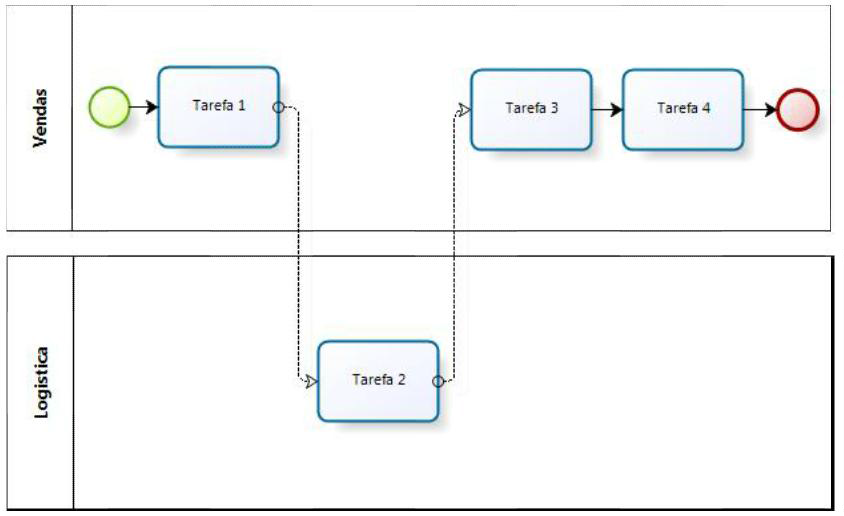
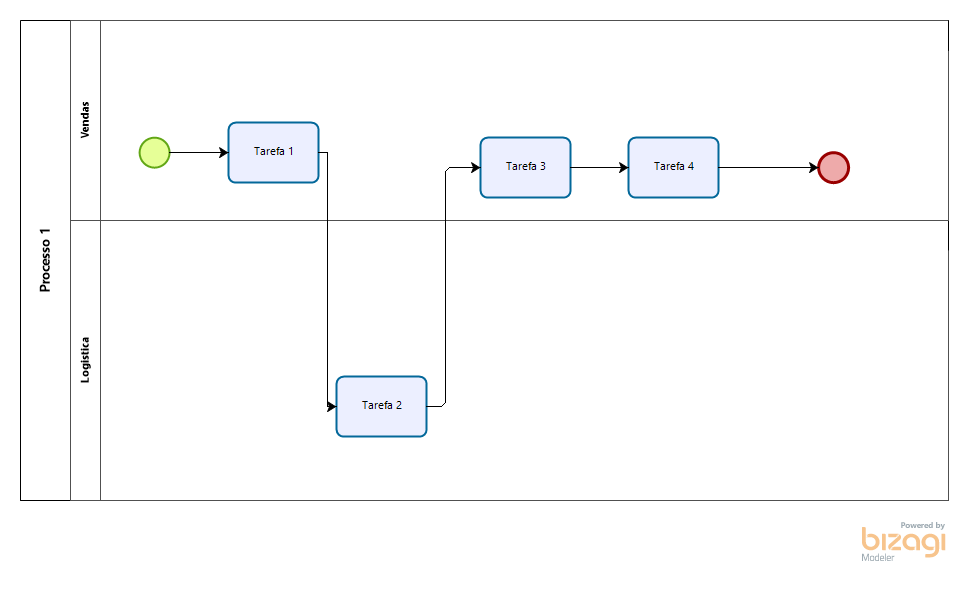

### Pergunta  

BPMN (Business Process Modeling Notation) é uma notação para representar processos de negócios através de diagramas de processos de negócio (Business Process Diagram – BPD). Baseado em flow chart , possibilita que os elementos básicos sejam facilmente interpretados, visando fornecer uma notação que possa ser entendida tanto pelo pessoal de negócio como de TI, eliminando a lacuna entre o desenho do processo e a implementação do processo.

No BPD abaixo, quais as inconsistências de acordo com a BPMN:

---

A tarefa 2 está incorretamente ligada, visto que para ligar tarefas é utilizada a linha contínua. 

A linha tracejada é utilizada para representar uma mensagem e/ou sinal, sendo utilizada para representar quando temos mensagens entre processos  ou participantes (piscinas). Esta linha não deve estar dentro de uma piscina, por exemplo ligando duas tarefas.

Neste caso, como estamos ligando as atividades para geral um fluxo de sequência (que utiliza a seta comum para ligar duas tarefas). O correto para este caso seria ligar a tarefa 1 e a tarefa 2, bem como a tarefa 2 e 3, com uma linha reta.

Além disso, as duas piscinas deveriam ser transformadas em duas raias, pois dessa maneira teríamos as ligações entre as tarefas (e  ter um fluxo correto) e teríamos o processo com os papeis corretamente organizados. Ficaria assim o processo:

Imagem

Usa-se piscinas diferentes, para representar ou participantes, ou uma entidade de negócio.

---

Governança de TI é definida como "uma estrutura de relacionamento e processos para dirigir e controlar uma organização, a fim de atingir os objetivos corporativos, adicionando valor ao negócio e equilibrando os riscos em relação ao retorno do investimento em TI e seus processos".

Das opções abaixo qual apresenta um dos principais benefícios da Governança de TI?

- [x] a. Definir claramente a responsabilidade da TI
- [ ] b. Reduzir os custos de TI
- [ ] c. Utilização das últimas tecnologias do mercado
- [ ] d. Aumentar o orçamento para projetos de TI
- [ ] e. Fazer mais uso de tecnologia

---

A governança de TI administra um ambiente formado por:

- [ ] a. Tecnologia da informação
- [x] b. Pessoas, processos e tecnologia
- [ ] c. Instituições, legislação e recursos técnicos
- [ ] d. Investidores, tecnologia e informação
- [ ] e.Tecnologia, acionistas e padrões

---
Segundo o BPM, um Papel é um conjunto de responsabilidades concedido a um indivíduo ou grupo que atua no processo, podendo ser representados nesse como pela sua posição ou grupo funcional.

Em um BPD baseando na BPMN, os papei são representados através do elemento:

- [ ] a gateway
- [ ] b fluxo
- [ ] c atividade
- [ ] d piscina
- [x] e raia

---

A BPMN foi desenvolvida especificamente para representar processos de negócio, e fornecer uma notação que possa ser entendida tanto pelo pessoal de negócio como de TI, eliminando a lacuna entre o desenho do processo e a implementação do processo.

Qual das alternativas abaixo pode ser representada através de diagramas de processos de negócio?

- [ ] a Estratégia
- [ ] b .Estrutura e recursos organizacionais
- [ ] c Regras de negócio * errada
- [ ] d Rotinas departamentais
- [ ] e  Modelos de dados e informação

---

"A partir de 2002 o Governo americano apresentou inovações nos padrões de responsabilidades das empresas e promoveu uma ampla regulação da vida corporativa, fundamentada nas boas práticas de governança. O foco da lei recaiu sobre os quatro valores básicos: Compliance, accountability, disclosure e fairness."

Qual lei americana visa prover a confiança do investidor nas organizações?

- [x] Lei Sarbanes-Oxley
- [ ] Lei Basileia
- [ ] Acordo da Brasileira II
- [ ] Lei de reservas e patentes
- [ ] Lei de reserva de mercado

---

Das alternativas abaixo, assinale a única correta:

- [ ] a A maioria das ferramentas de modelagem de processos ainda não se adaptou à BPMN
- [ ] b Nenhuma das alternativas está correta
- [ ] c A BPMN é dependente de ferramentas, sistemas ou plataformas tecnológicas
- [ ] d Existem poucas ferramentas gratuitas com suporte à BPMN
- [x] e O uso de artefatos da BPMN serve para adicionar informações complementares ao processo

---

Escreva brevemente a respeito dos processos TO-BE e AS-IS, e  o que você sabe sobre processos privados, processos públicos e processos colaborativos.

Para ambas, seria pertinente responder:
#### **O que são?**

**As is** é a representação de um processo no momento inicial, contendo erros e acertos, de maneira que pode ser alterado. Quando modificamos e alteramos a representação de um processo, esse torna-se **To be,** pois são incluídas melhorias, inovações e modificações. O **to be** também pode ser desenvolvido diretamente, entretanto, esse não possuirá apenas o **caminho do final feliz**, que é o fluxo básico do início até o final, como o **as is**.

#### Quando utilizá-los?

Devemos usar o **As-Is** quando estamos compreendendo como é o processo, ou quando ele é de importância estratégica, e já o **to-be**, quando já sabemos e identificamos melhorias possíveis e/ou quando podemos escrever um novo processo. 

#### Quais as suas principais diferenças?

O **As-is** tem apenas o **caminho feliz**, ou seja, o caminho inicial /básico, sem detalhes. Já o **To-be** já é mais detalhado, e possui subprocessos, o caminho feliz, e é uma melhora do as-is, sabendo-se que esse já é conhecido e já foi desenvolvido.

---

A principal tarefa para se ter uma boa Governança de TI alinhada ao negócio é:

- [ ] a Terceirizar os recursos de hardware e software
- [ ] b Integrar os sistemas em ambiente de ERP
- [x] c Otimizar os gastos com TI, com investimentos direcionados aos objetivos de negócio
- [ ] d Procurar atualização constante no ambiente tecnológico
- [ ] e Nenhuma das alternativas está correta

---

Qual das seguintes opções pode ser considerada um benefício do alinhamento estratégico em uma organização?

- [ ] a Entregar um serviço dentro do tempo e orçamento previstos
- [ ] b Utilização das últimas tecnologias do mercado
- [ ] c Ser o primeiro para o mercado * errado
- [ ] d Melhor administração dos investimentos em TI
- [ ] e Nenhuma das alternativas está correta