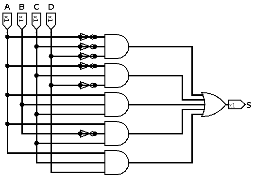

**Nome:** Gustavo Leão Nogueira de Oliveira

|        | A    | B    | C    | D    | S    |
| ------ | ---- | ---- | ---- | ---- | ---- |
| **0**  | 0    | 0    | 0    | 0    | 1    |
| **1**  | 0    | 0    | 0    | 1    | 0    |
| **2**  | 0    | 0    | 1    | 0    | 1    |
| **3**  | 0    | 0    | 1    | 1    | 0    |
| **4**  | 0    | 1    | 0    | 0    | 1    |
| **5**  | 0    | 1    | 0    | 1    | 0    |
| **6**  | 0    | 1    | 1    | 0    | 1    |
| **7**  | 0    | 1    | 1    | 1    | 0    |
| **8**  | 1    | 0    | 0    | 0    | 1    |
| **9**  | 1    | 0    | 0    | 1    | 1    |
| **10** | 1    | 0    | 1    | 0    | 0    |
| **11** | 1    | 0    | 1    | 1    | 1    |
| **12** | 1    | 1    | 0    | 0    | 0    |
| **13** | 1    | 1    | 0    | 1    | 0    |
| **14** | 1    | 1    | 1    | 0    | 1    |

| A B\C D | 0 0  | 0 1  | 1 1  | 1 0  |
| ------- | ---- | ---- | ---- | ---- |
| **0 0** | 1    | 0    | 0    | 1    |
| **0 1** | 1    | 0    | 0    | 1    |
| **1 1** | 0    | 0    | 1    | 1    |
| **1 0** | 1    | 1    | 1    | 0    |

$$
S=(\bar{A}.\bar{C}.\bar{D})+(\bar{A}.C.\bar{D})+(A.B.C)+(A.\bar{B}.C)+(A.C.D)
$$

