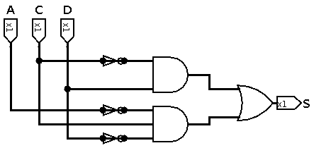
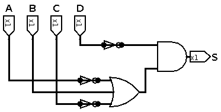

**Nome:** Gustavo Leão Nogueira de Oliveira
$$
F(X,Y,Z)=\sum m{(1,2,5)}
$$

|       | X    | Y    | Z    | S    |
| ----- | ---- | ---- | ---- | ---- |
| **0** | 0    | 0    | 0    | 0    |
| **1** | 0    | 0    | 1    | 1    |
| **2** | 0    | 1    | 0    | 1    |
| **3** | 0    | 1    | 1    | 0    |
| **4** | 1    | 0    | 0    | 0    |
| **5** | 1    | 0    | 1    | 1    |
| **6** | 1    | 1    | 0    | 0    |
| **7** | 1    | 1    | 1    | 0    |

| X \ Y Z | 0 0  | 0 1  | 1 1  | 1 0  |
| ------- | ---- | ---- | ---- | ---- |
| **0**   | 0    | 1    | 0    | 1    |
| **1**   | 0    | 1    | 0    | 0    |

$$
S=(\bar{C}.D)+(\bar{A}.C.\bar{D})
$$

---

$$
F(A,B,C,D)=\prod M{(1,3,5,7,11,13,15)}
$$

|        | A    | B    | C    | D    | S    |
| ------ | ---- | ---- | ---- | ---- | ---- |
| **0**  | 0    | 0    | 0    | 0    | 1    |
| **1**  | 0    | 0    | 0    | 1    | 0    |
| **2**  | 0    | 0    | 1    | 0    | 1    |
| **3**  | 0    | 0    | 1    | 1    | 0    |
| **4**  | 0    | 1    | 0    | 0    | 1    |
| **5**  | 0    | 1    | 0    | 1    | 0    |
| **6**  | 0    | 1    | 1    | 0    | 1    |
| **7**  | 0    | 1    | 1    | 1    | 0    |
| **8**  | 1    | 0    | 0    | 0    | 1    |
| **9**  | 1    | 0    | 0    | 1    | 1    |
| **10** | 1    | 0    | 1    | 0    | 0    |
| **11** | 1    | 0    | 1    | 1    | 0    |
| **12** | 1    | 1    | 0    | 0    | 1    |
| **13** | 1    | 1    | 0    | 1    | 0    |
| **14** | 1    | 1    | 1    | 0    | 1    |
| **15** | 1    | 1    | 1    | 1    | 0    |

| A B\C D | 0 0  | 0 1  | 1 1  | 1 0  |
| ------- | ---- | ---- | ---- | ---- |
| **0 0** | 1    | 0    | 0    | 1    |
| **0 1** | 1    | 0    | 0    | 1    |
| **1 1** | 1    | 0    | 0    | 1    |
| **1 0** | 1    | 1    | 0    | 0    |

$$
S=\bar{D}.(\bar{A}+B+\bar{C})
$$

