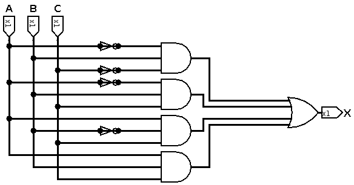
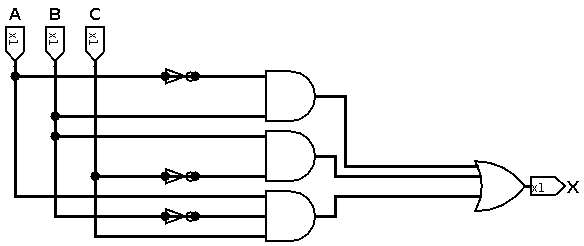
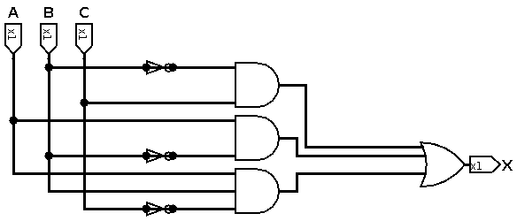
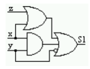
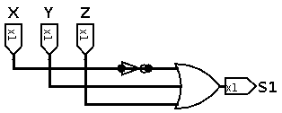
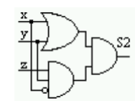
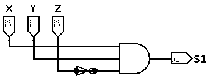

Faculdade Senac Porto Alegre
	Curso Superior de Tecnologia em Redes de Computadores
	Curso Superior de Tecnologia em Análise e Desenvolvimento de Sistemas
		Disciplina: Organização de Computadores

**Atividade - Simplificação de expressões lógicas e circuitos com Mapas de Karnaugh**

**Nome:** Gustavo Leão Nogueira de Oliveira

0) De acordo com a expressão:

$$
    X=\bar{A}.B.\bar{C}+\bar{A}.B.C+A.\bar{B}.C+A.B.C
$$

a. Mostre o diagrama lógico (circuito) correspondente:

b. Simplifique a expressão utilizando as propriedades da Álgebra Booleana ou Mapas de Karnaugh.

$$
    X=\bar{A}.B.\bar{C}+\bar{A}.B.C+A.\bar{B}.C+A.B.C
$$

|       | A | B | C | X |
|:-----:|:-:|:-:|:-:|:-:|
| **0** | 0 | 0 | 0 | 0 |
| **1** | 0 | 0 | 1 | 0 |
| **2** | 0 | 1 | 0 | 1 |
| **3** | 0 | 1 | 1 | 1 |
| **4** | 1 | 0 | 0 | 0 |
| **5** | 1 | 0 | 1 | 1 |
| **6** | 1 | 1 | 0 | 0 |
| **7** | 1 | 1 | 1 | 1 |

| A\BC  | 0 0 | 0 1 | 1 1 | 1 0 |
|:-----:|:---:|:---:|:---:|:---:|
| **0** |     |     |  1  |  1  |
| **1** |     |  1  |     |  1  |

$$
    X=\bar{A}.B+B.\bar{C}+A.\bar{B}.C
$$

c. Mostre o diagrama lógico da expressão mínima.

1) Projetar um circuito combinacional com portas lógicas E, OU e NOT, utilizando o menor número de portas possíveis, para a seguinte expressão:

$$
    S=\bar{X}.\bar{Y}.Z+X.Y.Z+X.\bar{Y}.\bar{Z}+X.\bar{Y}.Z
$$

|        | X | Y | Z | S |
|:------:|:-:|:-:|:-:|:--:|
| **0**  | 0 | 0 | 0 | 0 |
| **1**  | 0 | 0 | 1 | 1 |
| **2**  | 0 | 1 | 0 | 0 |
| **3**  | 0 | 1 | 1 | 0 |
| **4**  | 1 | 0 | 0 | 1 |
| **5**  | 1 | 0 | 1 | 1 |
| **6**  | 1 | 1 | 0 | 0 |
| **7**  | 1 | 1 | 1 | 1 |

| A\BC  | 0 0 | 0 1 | 1 1 | 1 0 |
|:-----:|:---:|:---:|:---:|:---:|
| **0** |     |  1  |     |     |
| **1** |  1  |  1  |     |  1  |

$$
    S=\bar{B}.C+A.\bar{B}+A.B.\bar{C}
$$

2) Simplifique os circuitos abaixo:

a. 

$$
    S1=(X+Z)+(X.Y)+\bar{Y}
$$

|        | X | Y | Z | $$ (X+Z) $$ | $$ (X.Y) $$ | $$ \bar{Y} $$ | $$ S1=(X+Z)+(X.Y)+\bar{Y} $$ |
|:------:|:-:|:-:|:-:|:-----------:|:-----------:|:-------------:|:----------------------------:|
| **0**  | 0 | 0 | 0 | 0 | 0 | 1 | 1 |
| **1**  | 0 | 0 | 1 | 1 | 0 | 1 | 1 |
| **2**  | 0 | 1 | 0 | 0 | 0 | 0 | 0 |
| **3**  | 0 | 1 | 1 | 1 | 0 | 0 | 1 |
| **4**  | 1 | 0 | 0 | 1 | 0 | 1 | 1 |
| **5**  | 1 | 0 | 1 | 1 | 0 | 1 | 1 |
| **6**  | 1 | 1 | 0 | 1 | 1 | 0 | 1 |
| **7**  | 1 | 1 | 1 | 1 | 1 | 0 | 1 |

| X\YZ  | 0 0 | 0 1 | 1 1 | 1 0 |
|:-----:|:---:|:---:|:---:|:---:|
| **0** |     |     |  0  |     |
| **1** |     |     |     |     |

$$
    S1=\bar{X}+Y+Z
$$

---

b. 

$$
    S2=(X+Y).(X.Y.\bar{Z})
$$

|        | X | Y | Z | $$ (X+Y) $$ | $$ \bar{Z} $$ | $$ (X.Y.\bar{Z}) $$ | $$ S2=(X+Y).(X.Y.\bar{Z}) $$ |
|:------:|:-:|:-:|:-:|:-----------:|:-----------:|:-------------------:|:----------------------------:|
| **0**  | 0 | 0 | 0 | 0 | 1 | 0 | 0 |
| **1**  | 0 | 0 | 1 | 0 | 0 | 0 | 0 |
| **2**  | 0 | 1 | 0 | 1 | 1 | 0 | 0 |
| **3**  | 0 | 1 | 1 | 1 | 0 | 0 | 0 |
| **4**  | 1 | 0 | 0 | 1 | 1 | 0 | 0 |
| **5**  | 1 | 0 | 1 | 1 | 0 | 0 | 0 |
| **6**  | 1 | 1 | 0 | 1 | 1 | 1 | 1 |
| **7**  | 1 | 1 | 1 | 1 | 0 | 0 | 0 |

| X\YZ  | 0 0 | 0 1 | 1 1 | 1 0 |
|:-----:|:---:|:---:|:---:|:---:|
| **0** |     |     |     |     |
| **1** |     |     |     |  1  |

$$
    S2=X.Y.\bar{Z}
$$

---

3) Dada a Tabela Verdade abaixo:

|        | X | Y | Z | F1 | F2 |
|:------:|:-:|:-:|:-:|:--:|:--:|
| **0**  | 0 | 0 | 0 | 0 | 0 |
| **1**  | 0 | 0 | 1 | 1 | 0 |
| **2**  | 0 | 1 | 0 | 1 | 0 |
| **3**  | 0 | 1 | 1 | 0 | 1 |
| **4**  | 1 | 0 | 0 | 1 | 0 |
| **5**  | 1 | 0 | 1 | 0 | 1 |
| **6**  | 1 | 1 | 0 | 0 | 1 |
| **7**  | 1 | 1 | 1 | 1 | 1 |

a) Expresse F1 e F2 como soma de produtos, o mais simples possível.

| X\YZ  | 0 0 | 0 1 | 1 1 | 1 0 |
|:-----:|:---:|:---:|:---:|:---:|
| **0** |     |  1  |     |  1  |
| **1** |  1  |     |     |  1  |

$$
    F1=(X.\bar{Z})+(Y.\bar{Z})+(\bar{X}.\bar{Y}.Z)
$$

| X\YZ  | 0 0 | 0 1 | 1 1 | 1 0 |
|:-----:|:---:|:---:|:---:|:---:|
| **0** |     |     |  1  |     |
| **1** |     |  1  |  1  |  1  |

$$
    F2=(X.Z)+(X.Y)+(Y.Z)
$$

b) Expresse F1 e F2 como produto de somas, o mais simples possível.

| X\YZ  | 0 0 | 0 1 | 1 1 | 1 0 |
|:-----:|:---:|:---:|:---:|:---:|
| **0** |  0  |     |  0  |     |
| **1** |     |  0  |  0  |     |

$$
    F1=(\bar{X}+\bar{Y}+\bar{Z}).(X+\bar{Z}).(X+Z)
$$

| X\YZ  | 0 0 | 0 1 | 1 1 | 1 0 |
|:-----:|:---:|:---:|:---:|:---:|
| **0** |  0  |  0  |     |  0  |
| **1** |  0  |     |     |     |

$$
    F2=(\bar{Y}+\bar{Z}).(\bar{X}+\bar{Y}).(\bar{X}+\bar{Z})
$$

---

4) Escreva a expressão mínima correspondente às funções lógicas abaixo, utilizando mapas de Karnaugh e desenhe os circuitos correspondentes.

a) 
$$
    F(A,B,C,D)=\sum{m(0, 3, 4, 6, 8, 12)}
$$

|         | A | B | C | D | F |
|:-------:|:-:|:-:|:-:|:-:|:--:|
| **0**   | 0 | 0 | 0 | 0 | 1 |
| **1**   | 0 | 0 | 0 | 1 | 0 |
| **2**   | 0 | 0 | 1 | 0 | 0 |
| **3**   | 0 | 0 | 1 | 1 | 1 |
| **4**   | 0 | 1 | 0 | 0 | 1 |
| **5**   | 0 | 1 | 0 | 1 | 0 |
| **6**   | 0 | 1 | 1 | 0 | 1 |
| **7**   | 0 | 1 | 1 | 1 | 0 |
| **8**   | 1 | 0 | 0 | 0 | 1 |
| **9**   | 1 | 0 | 0 | 1 | 0 |
| **10**  | 1 | 0 | 1 | 0 | 0 |
| **11**  | 1 | 0 | 1 | 1 | 0 |
| **12**  | 1 | 1 | 0 | 0 | 1 |
| **13**  | 1 | 1 | 0 | 1 | 0 |
| **14**  | 1 | 1 | 1 | 0 | 0 |
| **15**  | 1 | 1 | 1 | 1 | 0 |

| AB\CD   | 0 0 | 0 1 | 1 1 | 1 0 |
|:-------:|:---:|:---:|:---:|:---:|
| **0 0** |  1  |     |  1  |     |
| **0 1** |  1  |     |     |  1  |
| **1 1** |  1  |     |     |     |
| **1 0** |  1  |     |     |     |

$$
    F=(\bar{C}.\bar{D})+(\bar{A}.\bar{B}.C.D)+(\bar{A}.B.C.\bar{D})
$$

b) 
$$
    F(A,B,C)=\prod{M(1, 2, 5, 7)}  
$$

|        | A | B | C | F |
|:------:|:-:|:-:|:-:|:--:|
| **0**  | 0 | 0 | 0 | 1 |
| **1**  | 0 | 0 | 1 | 0 |
| **2**  | 0 | 1 | 0 | 0 |
| **3**  | 0 | 1 | 1 | 1 |
| **4**  | 1 | 0 | 0 | 1 |
| **5**  | 1 | 0 | 1 | 0 |
| **6**  | 1 | 1 | 0 | 1 |
| **7**  | 1 | 1 | 1 | 0 |

| A\BC  | 0 0 | 0 1 | 1 1 | 1 0 |
|:-----:|:---:|:---:|:---:|:---:|
| **0** |     |  0  |     |     |
| **1** |  0  |  0  |  0  |     |

$$
    F=(A+\bar{B}).(A+C).(\bar{B}.C)
$$

C)
$$
    F(A,B,C,D)=\sum{m(1,3,7,11,15)}
$$

|         | A | B | C | D | F |
|:-------:|:-:|:-:|:-:|:-:|:--:|
| **0**   | 0 | 0 | 0 | 0 | 0 |
| **1**   | 0 | 0 | 0 | 1 | 1 |
| **2**   | 0 | 0 | 1 | 0 | 0 |
| **3**   | 0 | 0 | 1 | 1 | 1 |
| **4**   | 0 | 1 | 0 | 0 | 0 |
| **5**   | 0 | 1 | 0 | 1 | 0 |
| **6**   | 0 | 1 | 1 | 0 | 0 |
| **7**   | 0 | 1 | 1 | 1 | 1 |
| **8**   | 1 | 0 | 0 | 0 | 0 |
| **9**   | 1 | 0 | 0 | 1 | 0 |
| **10**  | 1 | 0 | 1 | 0 | 0 |
| **11**  | 1 | 0 | 1 | 1 | 1 |
| **12**  | 1 | 1 | 0 | 0 | 0 |
| **13**  | 1 | 1 | 0 | 1 | 0 |
| **14**  | 1 | 1 | 1 | 0 | 0 |
| **15**  | 1 | 1 | 1 | 1 | 1 |

| AB\CD   | 0 0 | 0 1 | 1 1 | 1 0 |
|:-------:|:---:|:---:|:---:|:---:|
| **0 0** |     |  1  |  1  |     |
| **0 1** |     |     |     |     |
| **1 1** |     |     |  1  |     |
| **1 0** |     |     |  1  |     |

$$
    F=(\bar{A}.\bar{B}.D)+(A.C.D)
$$

D) 
$$
    F(A,B,C,D)=\sum{m(0,2,5)}
$$

|         | A | B | C | D | F |
|:-------:|:-:|:-:|:-:|:-:|:--:|
| **0**   | 0 | 0 | 0 | 0 | 1 |
| **1**   | 0 | 0 | 0 | 1 | 0 |
| **2**   | 0 | 0 | 1 | 0 | 1 |
| **3**   | 0 | 0 | 1 | 1 | 0 |
| **4**   | 0 | 1 | 0 | 0 | 0 |
| **5**   | 0 | 1 | 0 | 1 | 1 |
| **6**   | 0 | 1 | 1 | 0 | 0 |
| **7**   | 0 | 1 | 1 | 1 | 0 |
| **8**   | 1 | 0 | 0 | 0 | 0 |
| **9**   | 1 | 0 | 0 | 1 | 0 |
| **10**  | 1 | 0 | 1 | 0 | 0 |
| **11**  | 1 | 0 | 1 | 1 | 0 |
| **12**  | 1 | 1 | 0 | 0 | 0 |
| **13**  | 1 | 1 | 0 | 1 | 0 |
| **14**  | 1 | 1 | 1 | 0 | 0 |
| **15**  | 1 | 1 | 1 | 1 | 0 |

| AB\CD   | 0 0 | 0 1 | 1 1 | 1 0 |
|:-------:|:---:|:---:|:---:|:---:|
| **0 0** |  1  |     |     |  1  |
| **0 1** |     |  1  |     |     |
| **1 1** |     |     |     |     |
| **1 0** |     |     |     |     |

$$
    F=(\bar{A}.\bar{B}.\bar{D})+(\bar{A}.B.\bar{C}.D)
$$

E) 
$$
    F(A,B,C)=\prod{m(3,4)}
$$

|        | A | B | C | F |
|:------:|:-:|:-:|:-:|:--:|
| **0**  | 0 | 0 | 0 | 1 |
| **1**  | 0 | 0 | 1 | 1 |
| **2**  | 0 | 1 | 0 | 1 |
| **3**  | 0 | 1 | 1 | 0 |
| **4**  | 1 | 0 | 0 | 0 |
| **5**  | 1 | 0 | 1 | 1 |
| **6**  | 1 | 1 | 0 | 1 |
| **7**  | 1 | 1 | 1 | 1 |

| A\BC  | 0 0 | 0 1 | 1 1 | 1 0 |
|:-----:|:---:|:---:|:---:|:---:|
| **0** |     |     |  0  |     |
| **1** |  0  |     |     |     |

$$
    F=(A+\bar{B}+\bar{C})(\bar{A}+B+C)
$$

---

5) Determine a Expressão simplificada para S1, S2, S3, S4 da seguinte tabela:

|  | A | B | C | D | S1 | S2 | S3 | S4 |
|:-:|:-:|:-:|:-:|:-:|:--:|:--:|:--:|:--:|
| **0** | 0 | 0 | 0 | 0 | 1 | 1 | 1 | 0 |
| **1** | 0 | 0 | 0 | 1 | 1 | 0 | 1 | 1 |
| **2** | 0 | 0 | 1 | 0 | 1 | 1 | 1 | 0 |
| **3** | 0 | 0 | 1 | 1 | 0 | 0 | 0 | 0 |
| **4** | 0 | 1 | 0 | 0 | 1 | 1 | 0 | 0 |
| **5** | 0 | 1 | 0 | 1 | 1 | 1 | 1 | 1 |
| **6** | 0 | 1 | 1 | 0 | 1 | 1 | 0 | 1 |
| **7** | 0 | 1 | 1 | 1 | 1 | 1 | 1 | 1 |
| **8** | 1 | 0 | 0 | 0 | 1 | 1 | 0 | 0 |
| **9** | 1 | 0 | 0 | 1 | 1 | 0 | 1 | 0 |
| **10** | 1 | 0 | 1 | 0 | 1 | 1 | 0 | 0 |
| **11** | 1 | 0 | 1 | 1 | 0 | 0 | 0 | 1 |
| **12** | 1 | 1 | 0 | 0 | 1 | 0 | 1 | 1 |
| **13** | 1 | 1 | 0 | 1 | 1 | 1 | 1 | 1 |
| **14** | 1 | 1 | 1 | 0 | 1 | 0 | 1 | 0 |
| **15** | 1 | 1 | 1 | 1 | 1 | 0 | 0 | 1 |

| AB\CD   | 0 0 | 0 1 | 1 1 | 1 0 |
|:-------:|:---:|:---:|:---:|:---:|
| **0 0** |     |     |  0  |     |
| **0 1** |     |     |     |     |
| **1 1** |     |     |     |     |
| **1 0** |     |     |  0  |     |

$$
    S1=(\bar{B}+C+D)
$$

| AB\CD   | 0 0 | 0 1 | 1 1 | 1 0 |
|:-------:|:---:|:---:|:---:|:---:|
| **0 0** |     |  0  |  0  |     |
| **0 1** |     |     |     |     |
| **1 1** |  0  |     |  0  |  0  |
| **1 0** |     |  0  |  0  |     |

$$
    S2=(\bar{A}+\bar{B}+D).(A+\bar{B}+D).(A+B+C).(A+B+\bar{D})
$$

| AB\CD   | 0 0 | 0 1 | 1 1 | 1 0 |
|:-------:|:---:|:---:|:---:|:---:|
| **0 0** |  1  |  1  |     |  1  |
| **0 1** |     |  1  |  1  |     |
| **1 1** |  1  |  1  |     |  1  |
| **1 0** |     |  1  |     |     |

$$
    S3=(\bar{C}.D)+(\bar{A}.\bar{B}.\bar{C})+(A.B.\bar{C})+(\bar{A}.B.D)+(\bar{A}.\bar{B}.C.\bar{D})+(A.B.C.\bar{D})
$$

| AB\CD   | 0 0 | 0 1 | 1 1 | 1 0 |
|:-------:|:---:|:---:|:---:|:---:|
| **0 0** |     |  1  |     |     |
| **0 1** |     |  1  |  1  |  1  |
| **1 1** |  1  |  1  |  1  |     |
| **1 0** |     |     |  1  |     |

$$
S4=(\bar{A}.\bar{C}.D)+(A.B.\bar{C})+(\bar{A}.B.C)+(A.C.D)
$$
