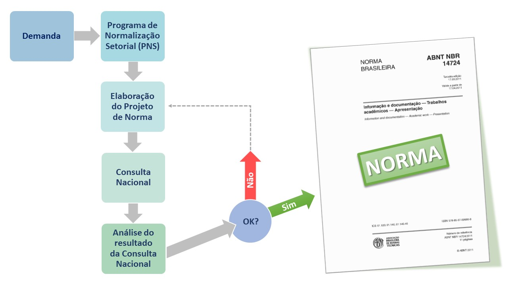

[Menu](../README.md)

# **Faculdade Senac Porto Alegre**

**Cursos: Superior de Tecnologia em Análise e Desenvolvimento de Sistemas e em Sistemas para Internet 1**

**Disciplina:** Qualidade de Software

**Professora:** Sirlei Sulzbach

# Atividade 2

### Participantes

Gustavo Leão, Bruni Renato e Antonio Tiez

### Etapas na criação de uma norma

---

#### Quais aspectos devem ser considerados na criação de uma norma? 

Como pode ser visto na imagem acima, é fundamental, primeiramente, ter uma **demanda** (apresentada por um pessoa, empresa, entidade, organismo regulamentador ou entidade) na forma de um **Documento Técnico ABNT**. Sendo esta demanda válida, é analisado pela ABNT, 

#### Apresente e comente algumas normas correspondentes a software. 

#### Aponte os grupos brasileiros que trabalham com os seguintes tópicos relacionados a software: 

##### Ergonomia

 

##### Métricas

#####  

##### Verificação e validação. 

#### Pesquise e apresente um exemplo de Histogramas (página 9).

---

# Criador

Olá me chamo Gustavo, e criei este material, para mais informações, clique nos links abaixo:

* [LinkTree](https://www.linktree.com.br/gusleaooliveira)

* Disponível em : [Repositório de exercícios](https://gusleaooliveira.github.io/posts/)

