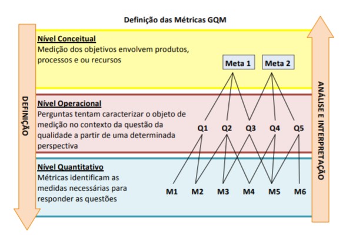

**Faculdade Senac Porto Alegre**

**Cursos:** Superior de Tecnologia em Análise e Desenvolvimento de Sistemas e em Sistemas para Internet 1

**Disciplina:** Qualidade de Software

**Professora:** Sirlei Sulzbach

# Método GQM

## Grupo

Gustavo Leão Nogueira de Oliveira, Marcus Badiale, Antonio Tietz e Bruno

## Sumário

[TOC]

## Desenvolvimento

### O que é?

Criado na década de 80, e melhorado na década de 90, o **GQM** (Goal Question Metric), é um método simplificado para fazer o planejamento de medições. Os principais objetivos desse modelo são para **definir**, **implantar**, **medir**, **analisar** e **melhorar** os **processos**.

### Para que é utilizado?

Ele é utilizado para **avaliar os defeitos** de um determinado **projeto**, de maneira a obtermos uma melhor medição do projeto.

### Qual a estrutura, e como funciona?

  Como pode ser visto na imagem acima, o GQM tem o formato Top-Down (de cima para baixo), onde identificamos as **metas organizacionais** e de projeto, no nível **conceitual**, que devem ser atingidas pelos **produtos**, **processos** e **recursos**. Após, no nível **operacional**, temos as **questões** de como as metas serão atingidas. Por fim, no nível **quantitativo**, temos as **métricas/medições** para responder as questões.

Ao termino da descida, podemos subir, como na imagem acima,  e analisar o quanto  o resultado das medições feitas anteriormente  respondem de maneira **quantitativa** ou **qualitativa** as questões (as metas) feitas inicialmente.

---

## Conclusão

Em virtude dos fatos sitados, podemos compreender que o GQM, criado nos anos 80, e melhorado nos anos 90, foi criado para fazer medições das metas organizacionais e de projeto, analisando, identificando e quantificando-as.     

---

## Referências bibliográficas

*  Carlos
Vinícius
Pereira
 da
 Silva, Déborah
 Carvalho
 de 
Moura, Danylo 
de
 Castro
 Campos, Paulo
 Nery. **GQM - Parte Escrita**. Disponível em:  *Acesso em: https://www.cin.ufpe.br/~scbs/metricas/seminarios/GQM_texto.pdf  de junho de 2020*

*  WIKPEDIA. **GQM**. Disponível em:  *Acesso em:  https://pt.wikipedia.org/wiki/GQM de junho de 2020*

*  LUIZA DALLORA, ANA. **Uso de medições com GQM (Goal Question Metric) no SCRUM**. Disponível em:  https://blog.myscrumhalf.com/uso-de-medicoes-com-gqm-goal-question-metric-no-scrum/#:~:text=Para%20solucionar%20estes%20problema%2C%20foi,em%20objetivos%20espec%C3%ADficos%20de%20medi%C3%A7%C3%A3o. *Acesso em:  24 de junho de 2020*

*  DAL’OSTO, FABIO. **Método para Avaliação de Ambientes de Desenvolvimento de Software Combinado CMM e GQM**. Disponível em: https://lume.ufrgs.br/handle/10183/6818 *Acesso em: 24  de junho de 2020*

*  GEVENES MARTINS, ALEXANDRE. **O uso do GQM nas medições da qualidade de software: um roteiro para definições de indicadores.** Disponível em:  http://cassiopea.ipt.br/teses/2011_EC_Alexandre_Gevenez.pdf *Acesso em:  24 de junho de 2020*

