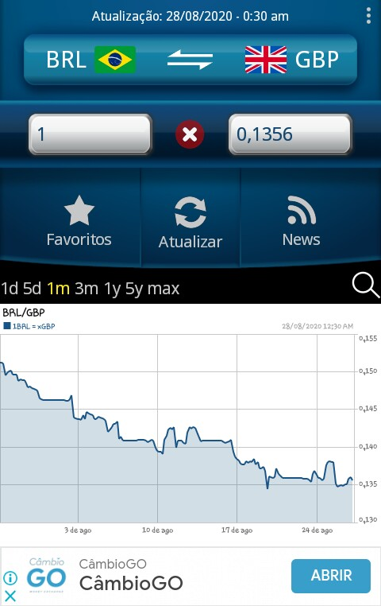
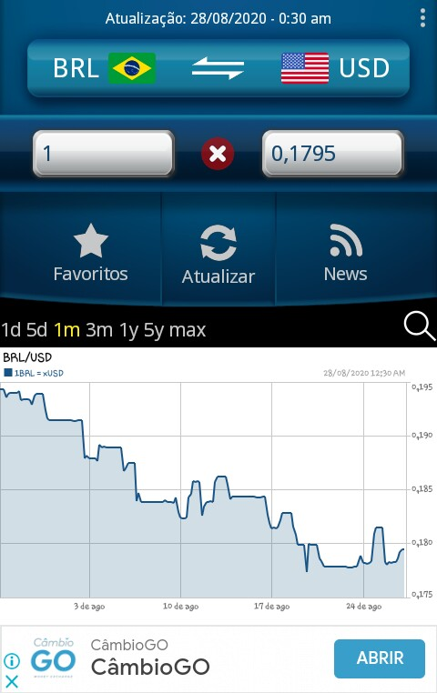
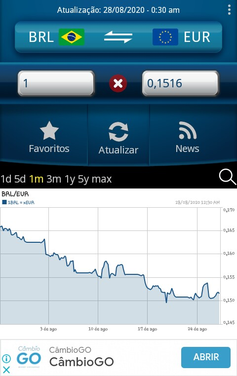
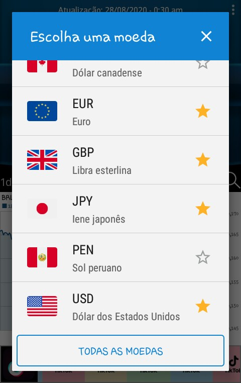
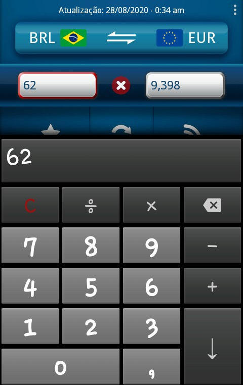
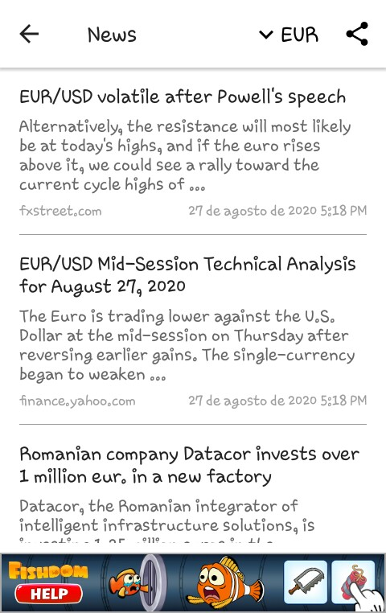
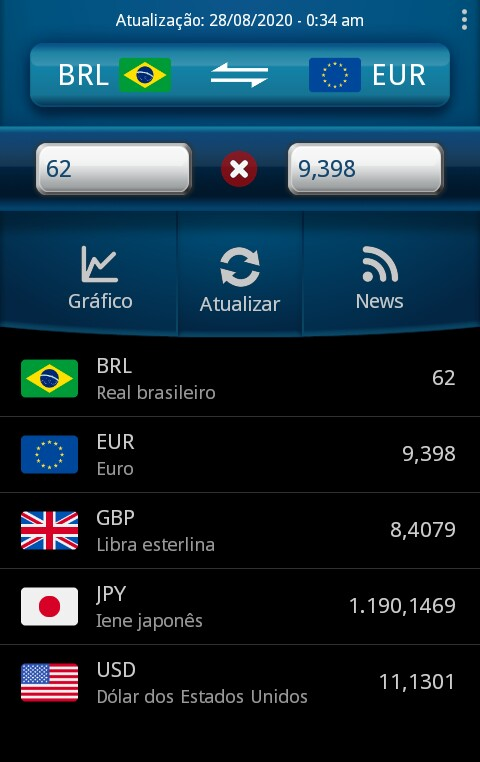

[Menu](../../README.md)

**Faculdade Senac Porto Alegre**

**Cursos: Superior de Tecnologia em Análise e Desenvolvimento de Sistemas e em Sistemas para Internet 1**

**Disciplina:** Qualidade de Software

**Professora:** Sirlei Sulzbach

# Exercicio aula 01

Formulário de avaliação do aplicativo/sistema 
 
---

## Instruções

1. Use o aplicativo/sistema, a fim de identificar seus elementos de funcionalidade e de usabilidade. 
2. Discuta com seu grupo a experiência de uso do aplicativo/sistema.
3. Escreva a percepção do grupo, acerca dos pontos percebidos no aplicativo/sistema.

---

### Enunciado
Imagine que, quando a pandemia tiver passado e começarmos a retomar atividades como viajar, passear, conhecer novos lugares e explorar roteiros turísticos, decidamos fazer um “mochilão” por diferentes países! Consequentemente, precisaremos saber o preço que pagaremos por todas as coisas que comprarmos nos locais em que estivermos: a diária de hotel, a passagem de trem, a pizza, a cerveja, as “lembrancinhas” para a família, e por aí vai. :smile:

Nesse cenário, faz-se necessário termos um “conversor de moedas”, ou seja, possuímos Reais (R$), e teremos de saber o equivalente em Dólares ($), Euros (€) ou Libras (£). Assim, a sua missão é ver o que há disponível para atender a nossa demanda, no que se refere a softwares – aplicativo/sistema. 

Com base no uso do aplicativo/sistema, realize a avaliação do mesmo, expressando as características que se destacaram. Procure apontar aspectos positivos e/ou negativos e comente-os.

Faça print screen das telas que chamaram a sua atenção; apresentando os seus pontos de destaque (ruins e/ou bons).

Por que você gostou ou não do aplicativo/sistema avaliado? Segundo a sua percepção, o aplicativo/sistema tem qualidade ou não? Comente.

---

### Integrantes do grupo: 

Gustavo Leão Nogueira de Oliveira

---

### Nota geral atribuída ao aplicativo/sistema (0 à 10):

:star::star::star::star::star::star::star:  (7/10)

---

### Resolução

Tendo em vista o cenário citado no enunciado,  foi escolhido o aplicativo **Conversor de moedas fácil - ExtraonAndroary**, por possuir uma facilidade de encontrar na loja de aplicativos (neste caso foi utilizada a *Play Store*); outros motivos da escolha por esse aplicativo foram que o mesmo apresenta uma boa avaliação na loja de aplicativos (4,5 :star:) e leve para baixar (:floppy_disk: 5,1 MB).

#### Um rápido review

##### Telas de conversores

* Nesta tela temos a escolha das duas moedas (basta clicar nas bandeiras), pode-se também, clicar nas setinhas para inverter. 
* Nas duas caixas de entrada de texto pode ser colocado o valor.
* O botão com o :x:  limpa para o padrão (1 para 1).
* Temos uma lista de botões, onde, respectivamente podemos mostrar os **favoritos**, **atualizar o gráfico** e **notícias**.
* Temos uma lista de botões para selecionarmos a variação no gráfico abaixo.
* Abaixo o gráfico, tempo x valor da moeda. 

##### Brasil :arrow_right: Libra

Abaixo mostra a conversão de **real** para **libra**.

##### Brasil :arrow_right: Dólar

Abaixo mostra a conversão de **real** para **dolar**.

##### Brasil :arrow_right: Euro

Abaixo mostra a conversão de **real** para **euro**.

##### Escolha da moeda

Podemos escolher uma moeda quando clicamos na bandeira como acima. Pode-se também favoritar clicando nas estrelas :star:. Clicando em mais moedas é possível selecionar mais moedas.

##### Trocando a quantidade

Clicando nas caixas de texto é possível calcular e selecionar a quantidade a ser caulculada.

##### Notícias

Clicando em notícias é possível ler notícias sobre a moeda, podendo ser selecionada, e compartilhar as imagens.

##### Favoritos

Pode-se ver a lista de favoritos, que mostra pelos ultimos selecionados, e ainda, mostrando a conversão das moedas. 

> Nota-se, que no local onde estava o item da lista (botão favorito), troca pelo botão para mostrar o gráfico.

#### Perguntas

1. **Por que você gostou ou não do aplicativo/sistema avaliado?** 

   Gostei por ser fácil a utilização, resolver o problema, ser leve e fácil de instalar.

2. **Segundo a sua percepção, o aplicativo/sistema tem qualidade ou não? Comente.**

   Creio que sim, pois resolve o problema.

3. **Apresentando os seus pontos de destaque (ruins e/ou bons).**

   **Positivos:**

   * Leve para baixar
   * Grátis
   * Fácil de utilizar
   * Funciona a conversão offline
   * Tem as moedas mais utilizadas
   * Mostra notícias sobre as moedas

   **Negativos:**

   * Necessita de internet para mostrar o gráfico e as notícias

   * Mostra um banner na parte de baixo, que pode distrair quem usa. Um outro banner é mostrado e dificil de ser tirado, quando clicado no botão de mostrar as notícias.

   * Algumas áreas e botões permanecem em inglês.

     

---

# Criador

Olá me chamo Gustavo, e criei este material, para mais informações, clique nos links abaixo:

* [LinkTree](https://www.linktree.com.br/gusleaooliveira)

* Disponível em : [Repositório de exercícios](https://gusleaooliveira.github.io/posts/)

