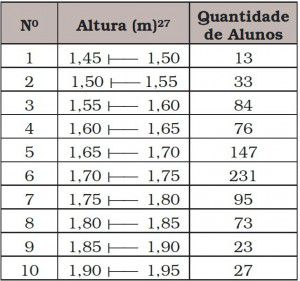

[Menu](../../README.md)

**Faculdade Senac Porto Alegre**

**Cursos:** Superior de Tecnologia em Análise e Desenvolvimento de Sistemas e em Sistemas para Internet 1

**Disciplina:** Qualidade de Software

**Professora:** Sirlei Sulzbach

# Etapas na criação de uma norma

## Grupo

Gustavo Leão Nogueira de Oliveira, Marcus Badiale, Antonio Tietz e Bruno

## Sumário

[TOC]

## Desenvolvimento

### Quais aspectos devem ser considerados na criação de uma norma?

Segundo a ABNT é necessário, para elaborar uma norma, que se tenha uma demanda. Essa, que deve ser apresentada pelos envolvidos no assunto, podendo assim, originar um **Documento Técnico ABNT**. 

Após o recebimento, a ABNT examinar a relevância da solicitação, através do **Comitê Técnico**, que recebe a mesma, e insere no **Programa de Normalização Setorial (PNS)**. 

Se, por ventura, houver necessidade da criação de um comitê relativo ao trato de determinada questão, é proposto que seja criado um:
* Comitê Brasileiro (ABNT/CB)
* Organismo de Normalização Setorial (ABNT/ONS)
* Comissão de Estudo Especial (ABNT/CEE)

 **Comissões de estudo**, que são responsáveis pela qualidade e pela revisão periódica de norma, juntamente quaisquer pessoas interessadas, podem opinar até que se obtenha um consenso de que seja criado o **Projeto de Norma**. 

 Recebendo a sigla de **ABNT NBR**, com seu respectivo número, e editorado, o projeto é enviado para à [Consulta Nacional](http://www.abntonline.com.br/consultanacional/) e também publicada no [Diário Oficial da União](https://www.in.gov.br/). 

 Na **Consulta Nacional** são envidados comentários e sugestões, que são avaliados pela Comissão de Estudo. Por fim, com o consenso de todos, o projeto torna-se um **Documento Técnico ABNT** que é homologado e publicado no [ABNTCatálogo](http://www.abntcatalogo.com.br/).    

   

> A cima tem um esquema de como é feita uma norma. Incluindo o processo de avaliação, de homologação e publicação do **Documento Técnico ABNT**.

---

### Apresente e comente algumas normas correspondentes a software.

**A série ISO 9000**

* **ISO 9001:** Norma internacional que estabelece requisitos para o **Sistema de Gestão da Qualidade (SGQ)**. Modelo para garantia da qualidade em projeto, desenvolvimento, produção, instalação e assistência técnica.
* **ISO 9002:** Modelo para garantia da qualidade em produção e instalação.
* **ISO 9003:** Modelo para garantia da qualidade em inspeção e dos ensaios finais.

**NBR 13596 Versão brasileira da ISO 9126**
É dividida em seis grandes grupos de características:

* **Funcionalidade:** Satisfaz as necessidades?
* **Confiabilidade:** É imune a falhas?
* **Usabilidade:** É fácil de usar?
* **Eficiência:** É rápido e "enxuto"?
* **Manutenibilidade:** É fácil de modificar?
* **Portabilidade:** É fácil de usar em outro ambiente?

**ISO 12207 - Processos do Ciclo de Vida do Software**
É dividida em três classes:

* Processos Fundamentais
* Processos de Apoio
* Processos de Organizacionais.

---

### Aponte os grupos brasileiros que trabalham com os seguintes tópicos relacionados a software:
#### Ergonomia:

O Laboratório de Utilizabilidade (LabIUtil) foi o primeiro laboratório de ergonomia do Brasil, A ABERGO também é responsável por publicar materiais sobre a ergonomia na concepção de software, disponibilizando vários materiais para análise.

#### Métricas:

Grupo SISO é composto de servidores comprometidos no conhecimento e na consolidação das atividades relacionadas a métricas de software, objetivando troca de informações e definição de padrões de métricas de software. 

Outro grupo é o ISBSG (International Software Benchmarking Standards Group) é uma organização sem fins lucrativos que possuem um banco de dados de métricas de projetos de software, para ajudar na administração de recursos na T.I

#### Verificação e validação:

O Grupo de Validação, Verificação e Teste de Sistema Computacionais do Instituto de Informática da UFRGS  pesquisa métodos cujo propósito é a melhoria da qualidade de software. Como exemplo, podemos citar:

* Critérios para construção de testes e metodologias para sua aplicação
* Modelos para a representação formal do sistema, sobre os quais podemos aplicar técnicas como
  * Construção de provas de correção utilizando assistentes de prova (semi-automatizado)
  * Verificação de modelos (automatizado)
* Formas de automatizar ou simplificar a construção de modelos de software
* Novas técnicas de análise sobre linguagens de programação ou modelos de software
* Desenvolvimento de novas ferramentas para validação e verificação de software  

---

### Pesquise e apresente um exemplo de Histogramas (página 9)

#### O que é um histograma?    

Um **histograma** é um gráfico de frequência que tem como objetivo ilustrar como uma determinada amostra ou população de dados está distribuída.

#### Um exemplo

Caso fosse necessário contabilizar, de forma gráfica, a altura de alunos em uma faculdade/colégio. Poderíamos fazer com um histograma.

Primeiramente façamos uma tabela:

Convertendo para o gráfico desse tipo, ficamos com um gráfico:

---

## Conclusão

Dessa forma, compreendemos como uma norma, segundo a ABNT é criada. Vimos a gradual validação do projeto de norma, que inicializa com uma demanda, passando Comitês e Comissões. Após avaliações do projeto, criado anteriormente, passando pela consulta nacional.

Vimos as série  de normas 9000, NBR 13596 e NBR 13596. Essas, respectivamente, focam em:

* Garantir a qualidade do software.
* Definir as características para um software com qualidade.
* Definir o ciclo de vida de um sistema.

Vimos também grupos que trabalham com a ergonomia de um software, como a ABERGO. O grupo SISP para métricas de software. E, também, o Grupo de Validação, Verificação e Teste de Sistema Computacionais do Instituto de Informática da UFRGS, que pesquisa métodos de melhoria da qualidade de software.

Por fim, vimos o exemplo de histogramas aplicado em um colégio/faculdade para medir a altura de alunos.

---

## Referências bibliográficas

* ABNT. **Como Elaborar Normas**. Disponível em: http://www.abnt.org.br/normalizacao/elaboracao-e-participacao/como-se-elaboram
* ABNTONLINE. **Consulta Nacional**. Disponível em: http://www.abntonline.com.br/consultanacional/
*  ABNTCATÁLOGO. **ABNTCatálogo**. Disponível em: https://www.abntcatalogo.com.br/
* ABNT. **Comitês Técnicos**. Disponível em: http://www.abnt.org.br/normalizacao/comites-tecnicos
* ABNT / CB-26. **PNS (Programa de Normalização Setorial)**. Disponível em: https://www.cb26.org.br/pan
*  ABNT / CB-26. **Comissões de Estudo**. Disponível em: https://www.cb26.org.br/comissoes-de-estudo
*  DIÁRIO OFICIAL DA UNIÃO. **Diário Oficial da União**. Disponível em: https://www.in.gov.br/
* ABNTCATÁLOGO. **Norma ABNT NBR ISO 9001:2015**. Disponível em: https://www.abntcatalogo.com.br/norma.aspx?ID=345041
* TI ESPECIALISTAS. **Análise sobre a ISO 9126 – NBR 13596**. Disponível em: https://www.tiespecialistas.com.br/analise-sobre-iso-9126-nbr-13596/
* WIKIPEDIA. **ISO/IEC 9126**. Disponível em: https://pt.wikipedia.org/wiki/ISO/IEC_9126 *Acesso em:  de junho de 2020*
* WIKIPEDIA. **ISO/IEC 12207**. Disponível em: https://pt.wikipedia.org/wiki/ISO/IEC_12207 *Acesso em:  de junho de 2020*
* ABERGO. **Grupos Técnicos**. Disponível em: http://www.abergo.org.br/internas.php?pg=grupos_tecnicos *Acesso em:  de junho de 2020*
* SISP. **Grupo de Trabalho - Métricas**. Disponível em: http://www.sisp.gov.br/ver-comunidade?community_id=10483894 *Acesso em:  de junho de 2020*
* UFRGS. **Grupo de Validação, Verificação e Teste**. Disponível em: http://www.ufrgs.br/verites/front-page *Acesso em:  de junho de 2020*
* FM2S. **O que é histograma? Quando utilizar? Como construir?**. Disponível em: https://www.fm2s.com.br/histograma/ *Acesso em:  de junho de 2020*
* COUTINHO, THIAGO. **Histograma: o que é, quais tipos existem e como montar um**. Disponível em: https://www.voitto.com.br/blog/artigo/o-que-e-um-histograma *Acesso em:  de junho de 2020*

---

# Criador

Olá me chamo Gustavo, e criei este material, para mais informações, clique nos links abaixo:

* [LinkTree](https://www.linktree.com.br/gusleaooliveira)

* Disponível em : [Repositório de exercícios](https://gusleaooliveira.github.io/posts/)

