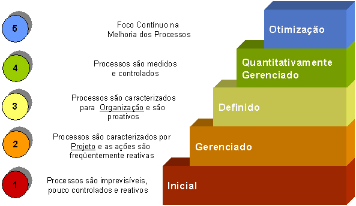

**Faculdade Senac Porto Alegre**

**Cursos:** Superior de Tecnologia em Análise e Desenvolvimento de Sistemas e em Sistemas para Internet 1

**Disciplina:** Qualidade de Software

**Professora:** Sirlei Sulzbach

# CMM e CMMI

## Grupo

Gustavo Leão Nogueira de Oliveira, Marcus Badiale, Antonio Tietz e Bruno

 

## Sumário

[TOC]

## Desenvolvimento

### CMMI
#### Relatório
##### O que é?

O **SEI** (ou *Software Engineering Institute*) , foi o responsável por criar o **CMMI** (ou *Capability Maturity Model Integration*), este é um modelo de qualidade e maturidade que possui boas práticas para melhorias no processo para desenvolvimento de software. Este modelo está dividido em cinco níveis. 

###### Os cinco níveis

Os cinco níveis do CMMI são:

As características dos níveis (respectivamente de 1 até 5) na imagem, são:

1. **Inicial:** é chamado assim pelo fato dos processos serem improvisados e/ou frequentemente não seguidos, além de prazos e custos que não são cumpridos. Não são feitas estimativas, e com as mesmas, o planejamento da empresa. A chance de sucesso dos projetos dependem exclusivamente das habilidades de quem trabalha nestes projetos. 
2. **Gerenciado:** neste nível, os processos, anteriormente improvisados e/ou nem seguidos, agora são melhor gerenciados. O planejamento é baseado em estimativas e experiências anteriores de outros projetos. Nos projetos, são utilizados processos definidos, usados, disseminados, documentos, medidos e fiscalizados com rotinas de melhoria. Por serem gerenciais, e não técnicos, os processos afetados pertencem aos projetos e não as pessoas, assim, não dependendo tanto das habilidades dos integrantes do projeto.
3. **Definido:** os processos, técnicos ou gerenciais, são estabelecidos, padronizados e repetidos em toda a organização. Tais processos, anteriormente pertencentes aos processos, agora pertencem a organização.
4. **Quantitativamente gerenciado:** já neste nível, os processos e produtos são medidos, de maneira a entender a qualidade e produtividade desses, portanto é estabelecido um controle estatístico de processos para medir tais necessidades (qualidade e produtividade dos processos e produtos). Assim, a gestão passa a ser feita com bases quantitativas.
5. **Otimização:** há um engajamento de todos os integrantes da corporação (organização) na melhora dos processos. São identificados pontos fracos e defeitos, e são tomadas ações para prevenir possíveis obstáculos, assim, mudanças significativas de processos e/ou tecnologias são feita a partir de análise de custo/benefício com base em dados quantitativos coletados.

##### Quanto custa?

O curso básico [Fundations of capabillity](https://cmmiinstitute.com/store/foundations-of-capability) com o preço variável entre $ 1.250,00 e $ 1.700,00, tendo a durabilidade de 2 dias para ser concluído. 

Outro curso é o [CMMI v2 Upgrade Traing](https://cmmiinstitute.com/store/cmmi-v2_0-upgrade-training) para empresas que já possuam certificado das versões anteriores ou o curso de  [Fundations of capabillity](https://cmmiinstitute.com/store/foundations-of-capability). Este curso tem o preço variável entre $ 700,00 e $ 790,00, tendo durabilidade de 1 dia para ser concluído.

##### Como é o processo?

É feito um curso, como os citados anteriormente, e que dão o conteúdo para que o CMMI seja aplicado na empresa.

Uma organização também pode ser avaliada de maneira a saber em qual nível está, e o que deve ser melhorado.  

##### Número de pessoas envolvidas?

Todos os funcionários da organização e, principalmente, os que trabalham diretamente com os processos, técnicos ou gerenciais, devem trabalhar para a melhorias, identificando pontos fracos e defeitos nos processos e melhorando-os.

##### Resultados obtidos?

* Os processos tornam-se melhor definidos, com foco em buscar as melhorias identificadas nos defeitos e pontos fracos (tendo uma iteração constante). Mais produtividade e agilidade pela praticidade  gerada na aplicação do CMMI. 

* O gerenciamento das atividades relativas à  produção de software aumenta consideravelmente.

* Uma melhora no comprimento de prazos e custos; 
* Uma melhor qualidade nos produtos; 
* Uma maior satisfação do cliente; 

##### Empresas que tem o certificado CMMI

Segundo o [ISD Brasil](http://www.isdbrasil.com.br/maturidade_mercado_nacional.php), o as empresas que possuem, em cada nível a seguir, o certificado são:

###### Nível 2

| Empresa | Estado |       Modelo        | Nível de maturidade |
| :-----: | :----: | :-----------------: | :-----------------: |
| SERPRO  |   PE   | SW-CMM :registered: |          2          |
|  Dell   |   RS   | SW-CMM :registered: |          2          |
|  Itaú   |   SP   | SW-CMM :registered: |          2          |
| SERASA  |   SP   | SW-CMM :registered: |          2          |
| Itautec |   SP   | SW-CMM :registered: |          2          |

**Quantidade de empresas neste nível:** 56

###### Nível 3

|                           Empresa                            | Estado |       Modelo        | Nível de maturidade |
| :----------------------------------------------------------: | ------ | :-----------------: | :-----------------: |
|                             IBM                              | SP     | SW-CMM :registered: |          3          |
|                      CWI Software Ltda.                      | RS     |  CMMI:registered:   |          3          |
|                           UNITECH                            | BA     | SW-CMM:registered:  |          3          |
|                  HP (Operação de Software)                   | RS     | SW-CMM:registered:  |          3          |
| CGI South América (Logica América do Sul Soluções de Tecnologia Ltda) | SP     |  CMMI:registered:   |          3          |

**Quantidade de empresas neste nível:** 48

###### Nível 4

|          Empresa           | Estado |      Modelo       | Nível de maturidade |
| :------------------------: | :----: | :---------------: | :-----------------: |
| CPM Braxis S/A (Capgemini) |   BA   | CMMI :registered: |          4          |

**Quantidade de empresas neste nível:** 1

###### Nível 5

|       Empresa       | Estado |      Modelo       | Nível de maturidade |
| :-----------------: | :----: | :---------------: | :-----------------: |
|         IBM         |   RJ   | CMMI :registered: |          5          |
|     CPM Braxis      |   BA   | CMMI :registered: |          5          |
|      ACCENTURE      |   SP   | CMMI :registered: |          5          |
| Instituto Atlântico |   CE   | CMMI :registered: |          5          |

**Quantidade de empresas neste nível:** 4

### O que se pode concluir sobre CMMI? 

CMMI é uma boa metodologia para melhoria de processos, e por consequência, uma melhoria no produto. Além disso,  esses processos tornam-se melhor definidos e sempre melhorados de maneira iterativa. 

### Como é o cenário no Brasil?

Como foi citado anteriormente, o  [ISD Brasil](http://www.isdbrasil.com.br/maturidade_mercado_nacional.php), em conjunto com o [CMMI Institute](https://cmmiinstitute.com/) há 18 anos,   é uma subsidiária da [Integrated System Diagnostics Incorporated](http://www.isd-inc.com/) que acompanha a evolução da família CMMI no Brasil. Os exemplos de empresas que possuem nível 2,3,4 e 5 no CMMI foram retirados da ISD Brasil, que possui uma quantidade maior de organizações que implementam esse método. A ISD Brasil quantifica e mostra como as empresas estão implementando esse método, como está sendo o treinamento de atualização e disponibilizando acesso às novas versões (como a atual V2.0).

---

## Conclusão

Com esse trabalho percebe-se que, o **CMMI** quando aplicado corretamente, pode fazer uma empresa que tinha muitos problemas, resolvê-los, tornando-se assim, empresas referências e/ou melhorando em diversos aspectos.

Foram vistos os níveis, que servem para **organizar** e **medir** como a **companhia**, os processos e seus funcionários se encontram, e como devem ser modificados de forma **gradual** e **contínua**.

Também foi visto exemplos de empresas que têm a certificação, quanto custa alguns cursos de certificação para funcionários aprenderem mais sobre o CMMI, quais os benefícios e como está o cenário no Brasil. 

---

## Referências bibliográficas

ISDBRASIL. **Maturidade do mercado nacional**. Disponível em: http://www.isdbrasil.com.br/maturidade_mercado_nacional.php Acesso em: 14 de outubro de 2020

CMMI INSTITUTE. **CMMI Institute**. Disponível em: https://cmmiinstitute.com/ Acesso em: 14 de outubro de 2020

ISDBRASIL. **O que é CMMI?**. Disponível em: http://www.isdbrasil.com.br/o-que-e-cmmi.php Acesso em: 14 de outubro de 2020

SILVA, MAURO. **CMMI para iniciantes**. Disponível em: http://www.linhadecodigo.com.br/artigo/1401/cmmi-para-iniciantes.aspx Acesso em: 14 de outubro de 2020

CMMI INSTITUTE. **What is CMMI?**. Disponível em:https://cmmiinstitute.com/cmmi/intro Acesso em: 14 de outubro de 2020

WIKIPEDIA. **CMMI**. Disponível em: https://pt.wikipedia.org/wiki/CMMI Acesso em: 14 de outubro de 2020

ISDONLINETV. **1 - ISD BRASIL - o que é o Nível 1 de Maturidade do CMMI** . Disponível em: https://www.youtube.com/watch?v=kF8sxDDoRns Acesso em: 14 de outubro de 2020

RENATO. **CMMI: uma visão geral**. Disponível em: https://www.devmedia.com.br/cmmi-uma-visao-geral/25425 Acesso em: 14 de outubro de 2020

FIGUEIREDO, EDUARDO. **O Modelo CMMI** . Disponível em: https://homepages.dcc.ufmg.br/~figueiredo/disciplinas/aulas/cmmi_v01.pdf  Acesso em: 14 de outubro de 2020

ARAKAKI, LEANDRO. **O que é CMMI?**. Disponível em: http://fabrica.ms.senac.br/2013/06/o-que-e-cmmi/ Acesso em: 14 de outubro de 2020

MONTONI, MARIANO. **Certificação CMMI: conheça os benefícios alcançados por empresas brasileiras**. Disponível em: https://promovesolucoes.com/certificacao-cmmi-conheca-os-beneficios-alcancados-por-empresas-brasileiras/  Acesso em: 14 de outubro de 2020

CMMI INSTITUTE. **CMMI V2.0 Upgrade Training**. Disponível em: https://cmmiinstitute.com/store/cmmi-v2_0-upgrade-training Acesso em: 14 de outubro de 2020

CMMI INSTITUTE. **Foundations of Capability**. Disponível em: https://cmmiinstitute.com/store/foundations-of-capability  Acesso em: 14 de outubro de 2020

ISDBRASIL. **Como comprovar a autenticidade de uma “certificação CMMI”**. Disponível em: http://www.isdbrasil.com.br/artigos/como-comprovar-a-autenticidade-de-uma-certificacao-cmmi.php Acesso em: 14 de outubro de 2020