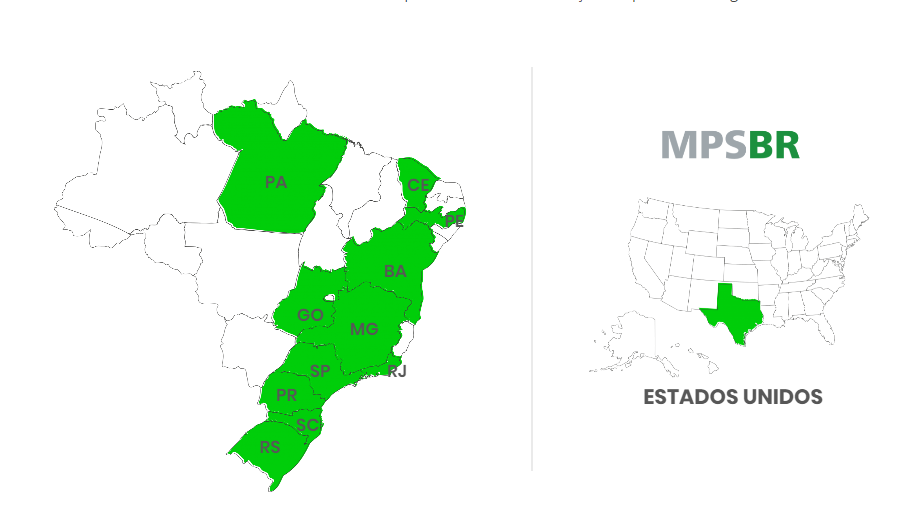

[Menu](../../README.md)

[TOC]

# MPS-BR
## Grupo
Gustavo Leão Nogueira de Oliveira, Marcus Badiale, Antonio Tietz e Bruno
## Faculdade Senac Porto Alegre
**Cursos:** Superior de Tecnologia em Análise e Desenvolvimento de Sistemas e em Sistemas para
Internet 1

**Disciplina:** Qualidade de Software

**Professora:** Sirlei Sulzbach

## Desenvolvimento
### Introdução
Em nosso país é notável a necessidade de melhoria na qualidade de desenvolvimento de software, serviços e melhores práticas para o RH. Tendo em vista tal carência, a Softex,baseado-se em um modelo chamado **CMMI** e baseando-se, também, no mercado brasileiro, teve a ideia de desenvolver algo parecido, mas de maneira que funcione de maneira mais efetiva para nosso país.

Comumente chamado de **MPS-BR**, o modelo de **Melhoria de Processos do Software** foi criado em 2003, pela **Softex**(Associação para a Promoção de Excelência do Software Brasileiro) em conjunto com o Ministério da Ciência, Tecnologia Inovação e Comunicações (**MCTIC**).

## Modelos de Referência
Como foi dito, havia a necessidade, para empresas de nosso país para melhorar a qualidade, e com a criação do **MPS-BR**, foi possível organizar para cada área necessitada o modelo ideal, como abaixo:

* **MPS-BR-SW:** este é voltado para a melhora no desenvolvimento de software, tanto no processo, quanto para a qualidade do produto final.

    A quantidade de avaliações no **Brasil** é de 804, e já no **exterior** é de 7.

* **MPS-BR-SV:** pode ser considerado um complemento para o MPS-BR-SW, este é um modelo de referência para serviços, e que vai de encontro com as necessidades desse mercado, auxiliando na melhoria de processo de serviços, e efetuando avaliações que verifiquem as práticas mais adequadas e que foram aderidas para este setor e como estão sendo praticadas pela empresa.
    
    A quantidade de avaliações no **Brasil** é de 76, e já no **exterior** é de 1.

* **MPS-BR-RH:** assim como o anterior, pode ser considerado um complemento para os dois anteriores, e é voltado para a melhora na gestão de pessoas (RH).
    
    A quantidade de avaliações no **Brasil** é de 2, e já no **exterior** é de 0.

## Avaliação de uma empresa
Como foi dito anteriormente este modelo foi desenvolvido baseado em nosso mercado, e que foi desenvolvido aqui, e que segue modelo de avaliação da empresa:

* **Habilitação do representante da equipe na equipe de avaliação:**

    * A empresa deve ter um ou mais integrantes da equipe que serão os representantes da empresa na equipe de avaliação, sendo necessária para tal tarefa ter independência para realizá-la.

* **Passo 1:**
    * Deve ser escolhida uma ou várias áreas da empresa e/ou até a empresa inteira.
    * Selecionar qual o modelo de referência adequado, escolhendo entre software (MPS-BR-SW), serviço (MPS-BR-SV) e gestão de pessoas (MPS-BR-RH), ou uma
    mistura entre esses.
    * Escolher qual o modelo e/ou nível a companhia se encontra mais adequada
    * Implementar os processos conforme o modelo escolhido anteriormente, sendo que:
        * Se a organização tiver colaboradores capacitados, o que é necessário para a implementação, estes auxiliam a implementar
        * Pode, também, se utilizar dos modelos de Software, Serviços e de Gestão
    de pessoas.

* **Passo 2:**
    * É necessário a contratação de uma **Instituição Avaliadora** autorizada, ou IA-MPS, habilitada pela [Softex](https://softex.br/), e que pode ser encontrada em [Instituições autorizadas](https://softex.br/mpsbr/instituicoes-autorizadas/).
        * Nesse site, temos um mapa com o abaixo, para escolher qual a empresa mais próxima, e que esteja habilitada a avaliar e qual o modelo que está habilitada a fazer a habilitação:

        

        * No caso do Rio Grande do Sul temos duas empresas capacitadas a fazer avaliações, São elas:
            * **Software Process:** pode dar verificação para o modelo
            MPS-BR-SW.
            * **Engsoft:** já esta, pode dar usar os modelos MPS-SV e MPS-SW

* **Passo 3:**
    * A comunicação é feita, através da IA-MPS, como no exemplo anterior da **Engsoft** e da **Software Proces**, para a Softex.
    * Um planejamento é feito, assim como, um acordo de confidencialidade
    * A avaliação inicial é realizada
    * O planejamento da avaliação final é produzido
    * É feita a avaliação final
    * Por fim, é realizada uma auditoria

* **Passo 4:**
    * O resultado oficial, assim como uma notícia, no caso de aprovação da avaliação são publicados na aba [notícias da Softext](https://softex.br/softexnews/), caso sinalizado no planejamento da avaliação, tendo a duração de três anos. Posteriormente ao prazo, a publicação do site é excluída, e deve ser feita nova avaliação.

## Níveis de maturidade

Por ser baseado no mercado brasileiro, no [CMMI](https://gusleaono.blogspot.com/2020/10/cmm-e-cmmi.html) e na norma [NBR ISO/IEC 12.207:2009](https://www.abntcatalogo.com.br/norma.aspx?ID=38643), o MPS possui sete níveis de maturidade. Cada um deles possui seus respectivos **processos**, que são **acumulativos** a cada nível, portanto, são implementados em um nível inferior, e também devem ser executados nos níveis subsequentes. Além disso, esses demonstram onde deve estar o foco dos esforços da empresa.

Na imagem abaixo é possível ver a organização dos níveis:

Abaixo, seguem os níveis e seus respectivos processos, iniciando do nível G e indo para o
nível A:
* **Nível G (parcialmente gerenciado):**
    * **Gerência de Projetos (GPR)**: o objetivo desse é fazer a gerência de projetos, bem como dar informações do projeto e realizar correções em caso de necessidade.
    
        Alguns dos resultados esperados para este processo são:
        
        * O escopo é projetado, definindo qual a solução resultante do projeto e as tarefas são definidas e trabalhadas.
        * Os prazos de entrega e estimativa são controlados através de cronogramas, de maneira que atrasos sejam evitados.
        * Outro ponto é o gerenciamento de custos, que é produzido de maneira a controlar os gastos excessivos do projeto.
        * Estabelecer a comunicação entre os colaboradores envolvidos no planejamento.
        * Deve haver interação entre o gerente de projetos e as partes interessadas (também chamadas de **Stakeholders**) que nada mais são do que todos interessados no resultado do projeto (como, por exemplo, o cliente). Deve-se alinhar as expectativas, os impactos e os benefícios da entrega.
        * Os riscos devem receber atenção, de modo que haja uma minimização e/ou evitação de impactos negativos. Oportunidades, ou riscos positivos, que possam trazer ganhos para o projeto devem ser identificados.
    * **Gerência de Requisitos (GRE):** já este, tem como propósito gerenciar os
    requisitos e, a obtenção correta desses junto aos fornecedores, identificando
    inconsistências entre os quesitos, os planos e os produtos do projeto gerenciado no
    processo anterior.
* **Nível F (gerenciado):**
    * **Aquisição (AQU):** as aquisições, como produtos ou contratações externas, são administradas, e incluídas nos custos do desenvolvimento do projeto.
    * **Gerência de Configuração (GCO):** todas as atividades devem ser gerenciadas de maneira que não interfiram umas nas outras, por quaisquer motivos. Assim como as atividades, todas as partes do projeto devem ser geridas e coordenadas pelo
    gerente de projetos.
    * **Garantia da Qualidade (GQA):** fazer a administração da qualidade, tendo em vista
    a **Qualidade do projeto**, que garante a entrega e o resultado conforme o cronograma. Bem como o anterior, a **Qualidade do Produto**, deve ser validada de maneira a ser comprovado que os requisitos e especificações, feitas no escopo do projeto, sejam atendidos.
    * **Gerência de Portfólio de Projetos (GPP):** esse processo tem como intuito inicializar e manter projetos que sejam necessários, suficiente e sustentáveis, de forma a atender os objetivos estratégicos da organização.
    * **Medição (MED):** neste a finalidade, como foi anteriormente dita (no nível de G), é coletar, armazenar analisar e relatar os dados relativos aos processos implementados na organização e em seus projetos.
* **Nível E (parcialmente definido):**
    * **Avaliação e Melhoria do Processo Organizacional (AMP):** são avaliados o quanto os processos da organização contribuem para o alcançar o objetivo da
    empresa, e em caso de necessidade, podem ser replanejados continuamente.
    * **Definição do Processo Organizacional (DFP):** neste estabelecer e manter um conjunto de ativos de processo organizacional e padrões do ambiente de trabalho usáveis e aplicáveis às necessidades de negócio da organização.
    * **Gerência de Recursos Humanos (GRH):** recursos humanos são essenciais, portanto, a qualificação dos profissionais que atuam no projeto, e por consequência, o gerenciamento do tempo e de responsabilidades desses devem ser bem geridos.
    * **Gerência de Reutilização (GRU):** temos como propósito para esse processo o gerenciamento do ciclo de vida dos ativos reutilizáveis.
* **Nível D (largamente definido):**
    * **Desenvolvimento de Requisitos (DRE):** definir os requisitos do cliente, do produto e dos componentes do produto é o objetivo deste processo.
    * **Integração do Produto (ITP):** o intuito é compor os componentes do produto, produzindo algo integrado e consistente com seu projeto, e demonstrar que os requisitos funcionais e não funcionais são satisfeitos para o ambiente alvo ou equivalente.
    * **Projeto e Construção do Produto (PCP):** o propósito é projetar, desenvolver e implementar soluções para atender aos requisitos
    * **Validação (VAL):** o propósito é confirmar que um produto ou componente do produto atenderá ao seu uso pretendido quando colocado no ambiente para o qual foi desenvolvido
    * **Verificação (VER):** o propósito é confirmar que cada serviço e/ou produto de trabalho do processo, ou do projeto atende apropriadamente os requisitos especificados
* **Nível C (definido):**
    * **Desenvolvimento para Reutilização (DRU):** o propósito é identificar oportunidades de reutilização sistemática de ativos na organização e, se possível, estabelecer um programa de reutilização para desenvolver ativos a partir de engenharia de domínios de aplicação
    * **Gerência de Decisões (GDE):** o propósito é analisar possíveis decisões críticas usando um processo formal, com critérios estabelecidos, para avaliação das alternativas identificadas
    * **Gerência de Riscos (GRI):** o propósito é identificar, analisar, tratar, monitorar e reduzir continuamente os riscos ao nível organizacional e de projeto

* **Nível B (gerenciado quantitativamente):**
    * Este nível deve atender aos atributos de processo (AP) anteriores e ao **AP 4.1**, onde o processo é objeto de análise quantitativa e do **AP 4.2**, onde o processo é controlado quantitativamente.
* **Nível A (em otimização):**
    * Este nível deve atender aos atributos de processo (AP) anteriores e ao **AP 5.1**, onde o processo é objeto de melhorias incrementais e inovações e **AP 5.2**, onde o processo é objeto de implementação de melhorias inovadoras e incrementais.

## CMMI x MPS.BR
### Comparação entre os dois modelos
Ambos modelos possuem compatibilidades, sendo inclusive, complementares. No caso o MPS.BR foi baseado no CMMI, como dito no início. Entretanto, não atendem o mesmo público, pois, enquanto o MPS.BR foi criado para empresas de médio e pequeno porte, principalmente brasileiras, o CMMI tem um foco global, geralmente para empresas de grande porte.

O CMMMI demanda de tempo, assim como altos custos e avaliações, que deixam o processo mais vagaroso. Desta maneira, no fator custo benefício e por ser um processo gradual e adequado para pequenas e médias empresas, o MPS.BR é mais vantajoso. Outros fatores para o aderimento do MPS nas organizações são a avaliação mais recorrente das empresas, a exigência no processo de licitações e a integração universidade-empresa.

Porém, o MPS.BR para organizações que desejam ser competitivas internacionalmente é insuficiente, sendo necessário e recomendado nesse caso, a utilização do CMMI.

### Adoção no mercado
No caso da MPS, no Rio Grande do Sul, temos duas empresas capacitadas a fazer
avaliações, São elas:
* **Software Process:** pode dar verificação para o modelo MPS-BR-SW.
* **Engsoft:** já esta, pode dar usar os modelos MPS-SV e MPS-SW

Segundo a Softext temos 890 empresas que possuem selo, dentre elas, as mais atuais, com o selo MPS-SW, são:

| Empresa | Cidade | Estado | Ano da Avaliação |Ano da Validade | Modelo |
|:-------:|:------:|:------:|:----------------:|:--------------:|:------:|
| Consystem Consultoria e Sistemas | Londrina | PR | 2017 | 2020 | MPS-SW ® |
| Join Tecnologia | Porto Alegre | RS  | 2017 | 2020 | MPS-SW ® |
| MV sistemas | Recife | PE | 2017 | 2020 | MPS-SW ® |
| Medicina Dianóstica MV | Teresópolis | RJ | 2017 | 2020 | MPS-SW ® |
| PD Case | | MG | 2017 | 2020 | MPS-SW ® |
| Numeria | Porto Alegre | RS | 2017 | 2020 | MPS-SW ® |
| Primak & Campos - Teorema Sistemas | Gurarapava | PR | 2017 | 2020 | MPS-SW ® |
| Process Informática | Maringá | PR | 2017 | 2020 | MPS-SW ® |
| Spread | São Paulo | SP|  2017 | 2020 | MPS-SW ® |
| SP Informática Santo | Antônio da Platina | PR | 2017 | 2020 | MPS-SW ® |
| TOTVS TFS Belém | Belém | PA | 2017 | 2020|  MPS-SW ® |

Já o CMMI, segundo o [ISD Brasil](http://www.isdbrasil.com.br/maturidade_mercado_nacional.php) temos um total de 105 empresas, dentre elas temos:

| Empresa | Estado | Modelo | Nível |
|:-------:|:------:|:------:|:-----:|
| IBM | RJ | CMMI ® | 5 |
| CPM Braxis | BA | CMMI ® | 5 |
| ACCENTURE  | SP | CMMI ® | 5 |
| Instituto Atlântico | CE | CMMI  ® | 5 |
| CPM Braxis S/A (Capgemini) | BA | CMMI ® | 4 |
| IBM | SP | SW-CMM ® | 3 | 
| CWI Software Ltda. | RS | CMMI ® | 3 |
| UNITECH | BA | SW-CMM ® | 3 |
| HP (Operação de Software) | RS | SW-CMM ® | 3 
| CGI South América (Logica América do Sul Soluções de Tecnologia Ltda) | SP | CMMI ® | 3 |

## Conclusão

Neste trabalho foi visto que o MPS.BR, criado aqui no Brasil pela Softex, é um modelo de
melhoria de processos de software. Este está dividido em três modelos de referência:
* O **MPS-SW** é voltado para o desenvolvimento de software.
* Já o **MPS-SV** para serviços.
* E o **MPS-RH** para recursos humanos (gerencia de pessoas).

Foi visto, também, os passos para uma avaliação da empresa, que se iniciam na aplicação de um determinado modelo de referência, passando pela contratação de uma instituição avaliadora, fazendo a avaliação da empresa, e por fim, a publicação do resultado.

A parte mais importante, é os níveis de maturidade, que como pode ser visto, iniciam no nível G e vão graduavelmente aumentando até o A. Nestes níveis, pode se destacar o **nível G**, que possui dois processos, o de **gerência de Projetos**, que administra como os projetos são feitos na empresa; e o de **Requisitos** que organiza o gerenciamento dos requisitos fornecidos).

O **nível F**, onde encontramos o **gerenciamento de aquisições**, como produtos ou contratações externas. Vemos também nesse nível a **gestão de configuração** que administra todas as atividades e partes do projeto. Temos a **garantia de qualidade** que define a garante a melhor qualidade para o projeto e produto. A **gerência de porrifólio de projetos** tem como intuito inicializar e manter projetos necessários, sustentáveis e suficientes para a organização. 

O **nível E** tem a **Avaliação e Melhoria do Processo Organizacional** são avaliados o quanto os processos da organização contribuem para o alcançar o objetivo da empresa, e em caso de necessidade, podem ser replanejados continuamente.

Já na **Definição do Processo Organizacional** estabelecer e manter um conjunto de ativos de processo organizacional e padrões do ambiente de trabalho usáveis e aplicáveis às necessidades de negócio da organização.

**Gerência de Recursos Humanos**, é mais um processo, onde vemos que recursos humanos são essenciais, portanto, a qualificação dos profissionais que atuam no projeto, e por consequência, o gerenciamento do tempo e de responsabilidades desses devem ser bem geridos.

**Gerência de Reutilização**, é outro processo desse nível, onde temos como propósito para esse processo o gerenciamento do ciclo de vida dos ativos reutilizáveis.

Por fim, temos a comparação, inevitável, entre CMMI e MPS.BR. Nota-se que temos muitos pontos positivos, como uma adoção gradual e mais fácil para pequenas e médias empresas que faz o MPS.BR ser mais procurado em nosso país. Outros pontos, como o custo e a compatibilizada, fazem o MPS.BR ter mais utilização em nosso país.

Entretanto, o uso do CMMI para transformar empresas competitivas internacionalmente ainda é recorrente, pois o MPS.BR não consegue concorrer com esse modelo.

Visto isso, e comparando os 890 do MPS.BR contra o 105 do CMMI, em nosso país notamos que, pelo menos, no cenário brasileiro o uso do MPS.BR é superior ao do CMMI.

## Bibliografia

DAIANY, **O que é MPS-BR**. Disponível em: https://blogdaqualidade.com.br/o-que-e-o-mps-br/#:~:text=O%20MPS%2DBR%20ou%20Melhoria,
de%20software%20nas%20empresas%20brasileiras Acesso em 31/10/2020

RENATO. **Maturidade no desenvolvimento de software: CMMI e MPS-BR**. Disponível
em: https://www.devmedia.com.br/maturidade-no-desenvolvimento-de-software-cmmi-e-mps-br/27010
Acesso em 31/10/2020

MONTONI, MARIANO. **Quais são os níveis de maturidade do MPS-BR**. Disponível em: https://promovesolucoes.com/quais-sao-os-niveis-de-maturidade-do-mps-br/ Acesso em
31/10/2020

SOFTEX. **Como uma empresa pode ser avalidada MPS-BR**. Disponível em: https://softex.br/mpsbr/#habilitacao-do-representante Acesso em 31/10/2020

SOFTEX. **Softext**. Disponível em: https://softex.br/ Acesso em 31/10/2020

SOFTEX. **MPS-BR**. Disponível em: https://softex.br/mpsbr/ Acesso em 31/10/2020

SOFTEX. **Modelo de Referência MPS-SW**. Disponível em: http://softex.br/mpsbr/modelos/#mpssw Acesso em 31/10/2020

SOFTEX. **Modelo de Referência MPS-SV**. Disponível em:
http://softex.br/mpsbr/modelos/#mpssv Acesso em 31/10/2020

SOFTEX. **Modelo de Referência MPS-RH**. Disponível em:
http://softex.br/mpsbr/modelos/#mpsrh Acesso em 31/10/2020

SOFTEX. **Software Process**. Disponível em: https://softex.br/network/software-process/
Acesso em 31/10/2020

SOFTEX. **Engsoft**. Disponível em: https://softex.br/network/engsoft/ Acesso em 31/10/2020

SOFTEX. **Instituições Autorizadas**. Disponível em:
https://softex.br/mpsbr/instituicoes-autorizadas/ Acesso em 31/10/2020

SOFTEX. **Softex News**. Disponível em: https://softex.br/softexnews/ Acesso em 31/10/2020

LEAO, GUSTAVO. **CMM e CMMI**. Disponível em: https://gusleaono.blogspot.com/2020/10/cmm-e-cmmi.html Acesso em 31/10/2020

SOFTEX. **MPS.BR - Melhoria de Processo do Software Brasileiro**. Disponível em: https://www.softex.br/wp-content/uploads/2013/07/MPS.BR_Guia_Geral_Software_2012-c-ISBN-1
.pdf Acesso em 1/11/2020

ABNTCATALOGO. **ABNT NBR ISO/IEC 12207:2009**. Disponível em: https://www.abntcatalogo.com.br/norma.aspx?ID=38643 Acesso em 1/11/2020

JUSTO, ANDREIA SILVA. **O que é gerenciamento de projetos? Veja as 10 áreas do PMBOOK**. Disponível em:https://www.euax.com.br/2018/07/principais-areas-do-gerenciamento-de-projetos/ Acesso em
1/11/2020

OLIVEIRA, CAMILA DA SILVA. **Comparando CMMi x MPS. BR: As Vantagens e Desvantagens dos Modelos de Qualidade no Brasil**. Disponível em: http://www.camilaoliveira.net/Arquivos/Comparando%20CMMi%20x%20MPS.pdf Acesso: 1/11/2020

FRANISCANI, **JULIANA DE FÁTIMA e PESTILI, LIGIA CRISTINA. CMMI e MPS.BR: Um Estudo Comparativo**. Disponível em: http://files.vivacquabd.webnode.com.br/200000160-51949528fa/CMMI%20e%20MPS.BR%20Um
%20Estudo%20Comparativo1.pdf Acesso dia 1/11/2020

SOFTEX. **EMPRESAS COM SELO MPS.BR NA LISTA DO GREAT PLACE TO WORK**. Dispo nível em :
https://softex.br/empresas-com-selo-mps-br-na-lista-do-great-place-to-work-3/#:~:text=Dextra%2C%20Radix%2C%20Metadados%20Assessoria%20e,cadastro%20do%20Programa%20MPS.BR. Acesso dia 1/11/2020

SOFTEX. **Avaliações Vigentes**. Disponível em:
https://softex.br/mpsbr/avaliacoes/?filter_tipo-avalicao_2f571=MPS-SWfilter_ano-data-validade_2f571=2020 Acesso dia 1/11/2020

---

# Criador

Olá me chamo Gustavo, e criei este material, para mais informações, clique nos links abaixo:

* [LinkTree](https://www.linktree.com.br/gusleaooliveira)

* Disponível em : [Repositório de exercícios](https://gusleaooliveira.github.io/posts/)
