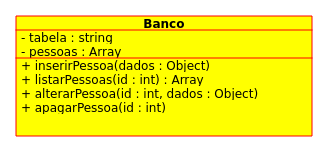

[Menu](../README.md)

# Design Patterns
## O que são?

Padrões de projeto são arquiteturas testadas para construir softwares, de maneira que, quando aplicados, reduzem a complexidade do processo de design, construindo assim, softwares **orientados a objetos** flexíveis e sustentáveis.

Por ser uma coleção de padrões de projetos de software, já contém soluções para **problemas conhecidos** e recorrentes descrevendo de maneira comprovada como  resolver determinado problema **recorrente**.

# Singleton

O singleton é um que é usado para quando necessitamos de apenas uma instancia de um objeto, como por exemplo, quando temos um objeto que trabalha com um banco de dados, que desejamos que tenha apenas uma instancia criada. Utilizando esse padrão de desenvolvimento temos apenas uma instancia, que será criada na primeira vez que for chamada, e caso seja novamente chamada, retornará a instancia criada anteriormente.

### Exemplo de uso

Vamos criar o objeto **Banco**, que terá como atributos **tabela**, que vai salvar o nome da tabela,  **pessoas**, para salvar a lista de pessoas que será cadastrada e os métodos **inserirPessoa**, que recebe um json com os dados da pessoa que serão salvos na lista de pessoas, **listarPessoas**, que vai listar as pessoas, ou apenas uma, da lista de pessoas, **apagarPessoa**, que apagará determinada pessoa da lista e **alterarPessoas**, que irá alterar os dados de dereminada pessoa.

Tendo isso em mente, ficamos com o seguinte uml:



#### Criando a estrutura do singleton

Para definirmos como será a estrutura do **Singlenton**, em javascript, precisamos criar uma variável com *nome* **Singlenton**, que terá atribuido uma **"closure"** que transforma o conteúdo de dentro da função privado e inacessível fora da **"closure"**. Ficará assim:

```javascript
let Singlenton = (() => {
	// Criação da classe aqui dentro
})();
```

Será utilizado aqui as **arrow functions**, no formato:

```javascript
( ) => {
	// Código a ser executado
}
```

Isso será utilizado no lugar de fazer as **funções anonimas**, no formato:

```javascript
function( ) {
	// Código a ser executado
}
```

Dentro dessa **"closure"**, será colocada a váriavel, privada, que terá a instância unica do objeto que será criado.

```javascript
let Singlenton = (() => {
  let instancia; // Instancia unica do objeto
})();
```

Vamos criar nosso objeto, para isso iremos usar a **função construtora**, que ira ser rodada para criar o objeto em si:

```javascript
let Singlenton = (() => {
  let instancia;

  function criarBanco(tabela){
    let objeto = new Object();
    objeto.tabela = tabela;
    objeto.pessoas = new Array();
    objeto.inserirPessoa = (item) => {
      objeto.pessoas.push(item);
    };
    objeto.listarPessoas = (id) =>{
      if(id == undefined){ return objeto.pessoas; }
      else { return objeto.pessoas[id]; }
    };
    objeto.apagarPessoa = (id) =>{
      if(id == undefined){ return null; }
      else { objeto.pessoas.splice(id, 1); }
    };
    objeto.alterarPessoa = (id, valor) =>{
      if(id == undefined){ return null; }
      else { objeto.pessoas[id] = valor; }
    };

    return objeto;
  }
})();
```

Essa função, recebera o nome da tabela, e criará o objeto adicionando os  atributos e métodos descritos anteriormente e retornará esse objeto criado.

Agora vem a parte mais importante, que é a de criar o método, que vai gerenciar as instâncias, que fica assim:

```javascript
let Singlenton = (() => {
  let instancia;

  function criarBanco(tabela){
    let objeto = new Object();
    objeto.tabela = tabela;
    objeto.pessoas = new Array();
    objeto.inserirPessoa = (item) => {
      objeto.pessoas.push(item);
    };
    objeto.listarPessoas = (id) =>{
      if(id == undefined){ return objeto.pessoas; }
      else { return objeto.pessoas[id]; }
    };
    objeto.apagarPessoa = (id) =>{
      if(id == undefined){ return null; }
      else { objeto.pessoas.splice(id, 1); }
    };
    objeto.alterarPessoa = (id, valor) =>{
      if(id == undefined){ return null; }
      else { objeto.pessoas[id] = valor; }
    };

    return objeto;
  }

  return {
    getInstancia: (tabela) => {
      if(!instancia){
        instancia = criarBanco(tabela);
      }
      return instancia;
    }
  }

})();
```

Esse método, verifica se a instância foi criada anteriormente, e caso não cria e a retorna, diferente disso apenas a re retorna.

#### Rodando e testando

Podemos criar dois objetos, e depois compararmos os dois, para exemplificar se são a mesma instância ou não. Gerando a instancia para os dois objetos:

```javascript
let banco1 = Singleton.getInstancia('tbl_exemplo');
let banco2 = Singleton.getInstancia('tbl_exemplo');
```

Comparando se é apenas uma instância do produto:

```javascript
console.log('Instancias iguais? '+(banco1 == banco2));
// Resultado: Instancias iguais? true
```

Inserindo os dados das pessoas, e testando, para demonstrar que é a mesma instancia:

```javascript
banco1.inserirPessoa({ "nome" : "Gustavo Leão", "email": "gus.leaono@gmail.com"});
banco2.inserirPessoa({ "nome" : "Sônia Nogueira", "email": "sonia_leoa69@hotmail.com"});
banco2.inserirPessoa({ "nome" : "João ", "email": "joao_teste@gmail.com"});
```


Mostrando que os dados foram inseridos no banco:

```javascript
console.log('Banco1:');
console.log(banco1.listarPessoas());

console.log('Banco2:');
console.log(banco2.listarPessoas());

/* Resultado:
Banco1:
[ { "nome" : "Gustavo Leão", "email": "gus.leaono@gmail.com"},
  { "nome" : "Sônia Nogueira", "email": "sonia_leoa69@hotmail.com"},
  { "nome" : "João ", "email": "joao_teste@gmail.com"} ]

Banco2:
[ { "nome" : "Gustavo Leão", "email": "gus.leaono@gmail.com"},
  { "nome" : "Sônia Nogueira", "email": "sonia_leoa69@hotmail.com"},
  { "nome" : "João ", "email": "joao_teste@gmail.com"} ]
 */


```

Listando apenas uma pessoa utilizando qualquer uma das instancias:

```javascript
console.log(banco2.listarPessoas(0));
// Resultado: { "nome" : "Gustavo Leão", "email": "gus.leaono@gmail.com"}
```


Apagando uma pessoa utilizando qualquer uma das instancias:

```javascript
banco1.apagarPessoa(1);
```

Alterando a pessoa no índice 1:

```javascript
banco2.alterarPessoa(1, { "nome" : "João Silva", "email": "joao_teste@gmail.com"});
```

Resultado:

```javascript
console.log('Banco1:');
console.log(banco1.listarPessoas());

console.log('Banco2:');
console.log(banco2.listarPessoas());

/* Resultado:
Banco1:
[ { "nome" : "Gustavo Leão", "email": "gus.leaono@gmail.com"},
  { "nome" : "João Silva", "email": "joao_teste@gmail.com"} ]

Banco2:
[ { "nome" : "Gustavo Leão", "email": "gus.leaono@gmail.com"},
  { "nome" : "João Silva", "email": "joao_teste@gmail.com"} ]
 */
```


# Prototype

O **Prototype** é usado para criar objetos com base em um modelo criado anteriormente através de clonagem. O objeto, que usa como base o objeto criado na função construtora, herda todos os seus métodos e atributos. Este **"design pattern"** é muito util quando utilizamos muito um objeto, e queremos apenas acrescentar mais metodos e atributos, criando assim um outro objeto, assim, não necessitando a criação de objetos excessiva.

## Criando e executando prototype

Vamos criar um objeto **pessoa**, que terá os atributos **nome** e **sobrenome**, que salvam o nome do usuário, **email** e **listaEmails**, que recebem o email e a lista de emails recebidos do usuário.

Teremos o método **nomeCompleto**, que simplesmente retorna o nome completo do usuário. Além desse, temos o método **mandarEmail**, que vai salvar na lista do usuário que vai receber o email o email contendo de quem foi mandado, a mensagem, e qual o conteúdo. Por fim, o método **listarEmails**, que lista os emails contidos no atributo **listaEmails** definido anteriormente.


```javascript
function Pessoa(nome, sobrenome, email, telefone){
  this.nome = nome;
  this.sobrenome = sobrenome;
  this.email = email;
  this.listaEmails = [];

  this.nomeCompleto = () => {
    return this.nome+' '+this.sobrenome;
  }
  this.mandarEmail = (pessoa, titulo, conteudo) => {
    pessoa.listaEmails.push(
      {
        "email": this.email,
        "titulo": titulo,
        "conteudo": conteudo
      });
  }
  this.listarEmails = () => {
    return this.listaEmails;
  }
}
```

> Foi utilizado uma função construtora, mas o ideal deve ser uma **"closure"**, tanto por ser um bom abito, quanto para deixar de maneira privada o que é necessário para o objeto. Foi escolhido apenas a função construtora, pois será mais fácil de demonstrar como criar um **prototype**.


Depois serão criados três objetos pessoa, a fim de exemplo, cada um com seus dados respectivos:

```javascript
let pessoa1 = new Pessoa("Eliane", "Francisca Ayla Moura", "elianefranciscaaylamoura_@focusnetworks.com.br");
let pessoa2 = new Pessoa("Bryan", "Pedro Lopes", "bryanpedrolopes..bryanpedrolopes@gmailo.com");
let pessoa3 = new Pessoa("Manuel", "Vinicius Baptista", "manuelviniciusbaptista-71@outlock.com.br");
```


Esses serão objeto que terão os métodos e atributos criados na função construtora criada anteriormente.

Agora será criado um objeto pessoa4, só que esse herdará os metodos e atributos criados anteiormente na função construtora, e ainda, mais o atributo telefone:

```javascript
let pessoa4 = Object.create(Pessoa);
pessoa4.nome = "Fabiana";
pessoa4.sobrenome = "Melissa Marcela Moraes";
pessoa4.email = "fabianamelissamarcelamoraes..fabianamelissamarcelamoraes@bsd.com.br";
pessoa4.telefone = "(51) 99999-9999";
```

Por fim vamos ver como ficaram os objetos criados anteriormente, e poderemos notar que o objeto pessoa4 é o único que possui o telefone:

```javascript
console.log(pessoa1);
console.log(pessoa2);
console.log(pessoa3);
console.log(pessoa4);
console.log(pessoa4.telefone);

/*
Resposta:

Pessoa {
  nome: 'Eliane',
  sobrenome: 'Francisca Ayla Moura',
  email: 'elianefranciscaaylamoura_@focusnetworks.com.br',
  listaEmails: [],
  nomeCompleto: [Function],
  mandarEmail: [Function],
  listarEmails: [Function] }
Pessoa {
  nome: 'Bryan',
  sobrenome: 'Pedro Lopes',
  email: 'bryanpedrolopes..bryanpedrolopes@gmailo.com',
  listaEmails: [],
  nomeCompleto: [Function],
  mandarEmail: [Function],
  listarEmails: [Function] }
Pessoa {
  nome: 'Manuel',
  sobrenome: 'Vinicius Baptista',
  email: 'manuelviniciusbaptista-71@outlock.com.br',
  listaEmails: [],
  nomeCompleto: [Function],
  mandarEmail: [Function],
  listarEmails: [Function] }
Function {
  nome: 'Fabiana',
  sobrenome: 'Melissa Marcela Moraes',
  email: 'fabianamelissamarcelamoraes..fabianamelissamarcelamoraes@bsd.com.br',
  telefone: '(51) 99999-9999' }
(51) 99999-9999

*/
```


***

# Criador

Olá me chamo Gustavo, e criei este material, para mais informações, clique nos links abaixo:

* [LinkTree](https://www.linktree.com.br/gusleaooliveira)


* Disponível em : [Repositório de exercícios](https://github.com/gusleaooliveira/materialEstudo)
