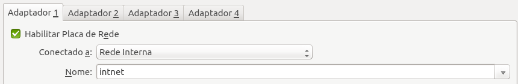
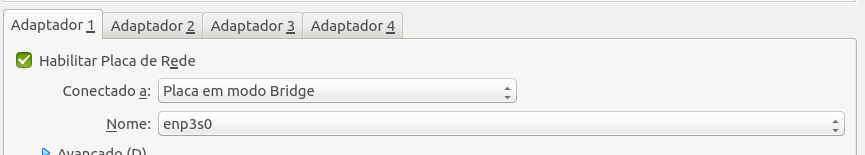
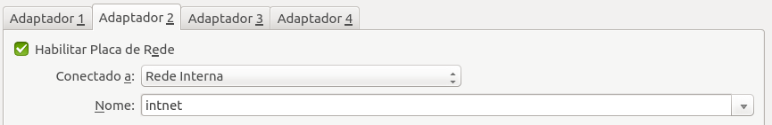
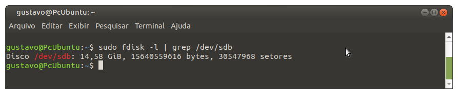
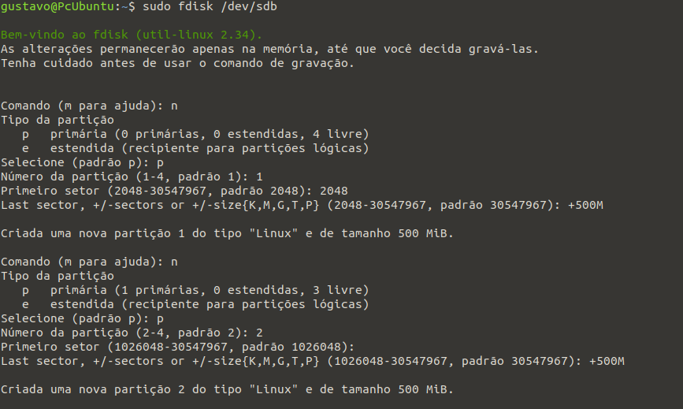
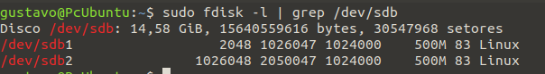
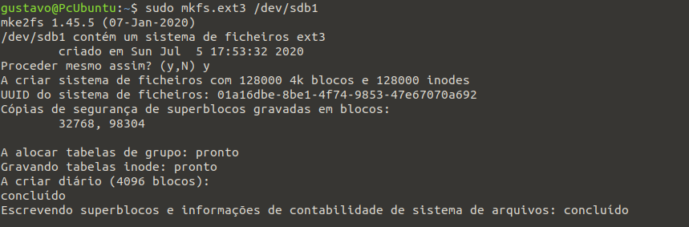
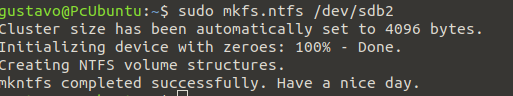

[Menu](../README.md)


**Superior em Tecnologia de Redes de Computadores**

**Disciplina:** Adm. de Sist. Op. Não-Proprietários

**Professor:** Ademir Dorneles


# Avaliação Prática III
## Tarefa 01: Configuração de Rede:

1. Antes de iniciar a sua VM, nas configurações do VirtualBox, adicione uma interface de rede com modo de operação definida como Rede Interna.




```bash
$ nano /etc/network/interfaces
auto enp0s3
iface enp0s3 inet6 static
address 10.0.0.1
netmask 24
```


2. Configure (no arquivo interfaces) as interfaces de rede conforme segue:

enp0s3 (bridge):  Defina a configuração para obter IPautomaticamente.
Enp0s8 (rede interna): IP: 10.10.10.1/24






```bash
$ nano /etc/network/interfaces
auto enp0s3
iface enp0s3 inet dhcp
auto enp0s8
iface enp0s8 inet static
address 10.0.0.1
netmask 24
```

3. Habilite o NAT definindo a interface enp0s3 como saída:

Servidor:

```bash
ip a flush enp0s3 && ip a flush enp0s8 && ifdown enp0s3 && ifdown enp0s8 && ifupenp0s3 && ifup enp0s8
```

Cliente:

```bash
ip a flush enp0s3 && ifdown enp0s3 && ifup enp0s3
```

4. Ative o ip_forward para definir que o kernel irá encaminhar pacotes (deverá ser ativado no arquivo de configuração):

```bash
$ nano /etc/sysctl.conf
net.ipv4.ip_forward=1
```

> Foi descomentado: net.ipv4.ip_forward=1

5. Teste a conexão da máquina com a internet:

```bash
$  ping  8.8.8.8
PING 8.8.8.8 (8.8.8.8) 56(84) bytes of data.
64 bytes from 8.8.8.8: icmp_seq=1 ttl=117 time=16.5 ms
64 bytes from 8.8.8.8: icmp_seq=2 ttl=117 time=16.8 ms
64 bytes from 8.8.8.8: icmp_seq=3 ttl=117 time=16.7 ms
64 bytes from 8.8.8.8: icmp_seq=4 ttl=117 time=16.4 ms
64 bytes from 8.8.8.8: icmp_seq=5 ttl=117 time=14.9 ms
64 bytes from 8.8.8.8: icmp_seq=6 ttl=117 time=14.9 ms
```

```bash
$ ping  www.google.com
PING www.google.com(2800:3f0:4001:809::2004 (2800:3f0:4001:809::2004)) 56 data bytes
64 bytes from 2800:3f0:4001:809::2004 (2800:3f0:4001:809::2004): icmp_seq=1 ttl=118 time=16.9 ms
64 bytes from 2800:3f0:4001:809::2004 (2800:3f0:4001:809::2004): icmp_seq=2 ttl=118 time=15.6 ms
64 bytes from 2800:3f0:4001:809::2004 (2800:3f0:4001:809::2004): icmp_seq=3 ttl=118 time=17.0 ms
64 bytes from 2800:3f0:4001:809::2004 (2800:3f0:4001:809::2004): icmp_seq=4 ttl=118 time=17.0 ms
64 bytes from 2800:3f0:4001:809::2004 (2800:3f0:4001:809::2004): icmp_seq=5 ttl=118 time=17.2 ms

```

## Tarefa 02: Instalação de Pacotes:

1. Verifique a configuração dos repositórios para instalação de pacotes via APT:

```bash
gustavo@PcUbuntu:~$ cat /etc/apt/sources.list
deb https://deb.debian.org/debian/ buster main
deb-src https://deb.debian.org/debian/ buster main

deb https://security.debian.org/debian-security buster/updates main
deb-src https://security.debian.org/debian-security buster/updates main

deb https://deb.debian.org/debian/ buster-updates main
deb-src https://deb.debian.org/debian/ buster-updates main
gustavo@PcUbuntu:~$
```

2. Atualize a lista de pacotes disponíveis no repositório com o comando “update”:

```bash
apt update
```

3. Com o gerenciador de pacotes APT, instale os utilitários g++, gcc e make:

```bash
apt install g++ gcc make -y
```

4. Com o gerenciador de pacotes APT, instale o software Apache:

```bash
apt install apache2 -y
```

5. Com o gerenciador de pacotes APT, instale a aplicação OpenSSH Server:

```bash
apt install openssh-server -y
```

6. Baixe o utilitário iptraf a partir do seguinte endereço:

http://sft.if.usp.br/debian/pool/main/i/iptraf/iptraf_3.0.0-8.1_amd64.deb

- [x] Baixado

```bash
wget -c http://sft.if.usp.br/debian/pool/main/i/iptraf/iptraf_3.0.0-8.1_amd64.deb
```

7. Instale o pacote .deb baixado:

```bash
dpkg -i iptraf_3.0.0-8.1_amd64.deb
```

8. Baixe o software nmap a partir do seguinte endereço:

https://nmap.org/dist/nmap-7.50.tar.bz2

- [x] Baixado

```bash
wget -c https://nmap.org/dist/nmap-7.50.tar.bz2
```

9. Descompacte, compile e instale a ferramenta nmap:

```bash
tar -jxvf nmap-7.50.tar.bz2
cd nmap-7.50/
./configure
make
make install
```

## Tarefa 03: Gerenciamento de Processo:

1. Com o comando ps liste os processos de todos usuários:

```bash
ps -a
```
2. Com o comando ps liste somente os processos não conectados a terminais:

```bash
ps -x
```
3. Liste a hierarquia de processos (árvore de processos) ativos no sistema:

```bash
pstree
```

4. Liste a hierarquia de processos (árvore de processos) ativos no sistema de forma que o comando mostre além dos nomes, os números que identificam os processos (PID):

```bash
pstree -p
```
5. Verifique o PID do processo denominado  “login”:

```bash
ps aux | grep "login"
```

6. Abra o **VI** em segundo plano executando o comando:  

```bash
vi &
```

* Identifique o valor que identifica o processo aberto pelo aplicativo **VI** em segundo plano:

```bash
gustavo@PcUbuntu:~$ jobs -l
[1]+ 24275 Parado (saída tty)     vi
```

* Traga o processo do **VI** para primeiro plano:

```bash
fg %1
```

## Tarefa 04: Gerenciamento de dispositivos:

Antes de iniciar a tarefa crie o diretório `/home/atividade03/tarefa04/`:


```bash
mkdir -p  atividade03/tarefa04
```

1. Desligue a máquina virtual e crie um novo disco rígido contendo o tamanho de 1Gb:




> Utilizei um pendrive com 14G como exemplo, portanto peguei ele completamente vazio para criar as partições. Ele ficou localizado em `/dev/sdb`


2. Crie duas partições (primárias) de 500 MB no disco criado:

```bash
fdisk /dev/sdb
```



As partições foram salvas como pode ser visto na imagem abaixo:

```bash
sudo fdisk -l | grep /dev/sdb
```



3. Formate a primeira partição com o sistema de arquivo ext3:

```bash
mkfs.ext3 /dev/sdb1
```



4. Formate a segunda partição com o sistema de arquivo ntfs:


```bash
mkfs.ntfs /dev/sdb2
```




5. Crie dois diretórios (disk01 e disk02) no diretório /mnt:

```bash
mkdir /mnt/disk01
mkdir /mnt/disk02
```

6. Monte a partição com sistema `ext3` no diretório **disk01**:

```bash
mount -t ext3 -o rw /dev/sdb1 /mnt/disk01
```

7. Monte a partição com sistema `ntfs` no diretório **disk02**:

```bash
mount -t ntfs -o rw /dev/sdb2 /mnt/disk02
```

8. Configure o arquivo fstab para montar automaticamente as duas partições na inicialização do sistema:

```bash
nano /etc/fstab
$ /dev/sdb1 /mnt/disk01 ext3 defaults,user,auto 0 0
$ /deb/sdb2 /mnt/disk02 ntfs defaults,user,auto 0 0
```

***

# Criador
Olá me chamo Gustavo, e criei este material, para mais informações, clique nos links abaixo:

* [LinkTree](https://www.linktree.com.br/gusleaooliveira)


* Disponível em : [Repositório de exercícios](https://gusleaooliveira.github.io/posts/)

<script data-ad-client="ca-pub-3232624848043560" async src="https://pagead2.googlesyndication.com/pagead/js/adsbygoogle.js"></script>
